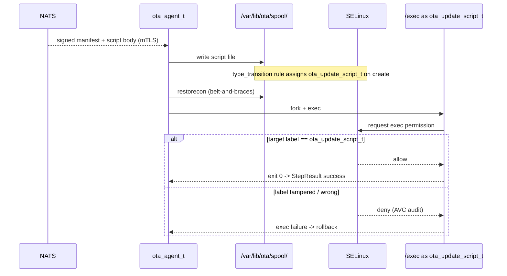

# ADR-0006 — SELinux strict Type Enforcement policy with dynamic script labeling

- **Status:** Proposed
- **Date:** 2026-04-21
- **Deciders:** Architecture Working Group, Security Officer
- **Related Requirements:** [NFR-12](../requirements/non-functional.md#nfr-12--selinux-strict-confinement-from-brief-deliverable-51), [FR-10](../requirements/functional.md#fr-10--cryptographic-verification-before-execution), [RC-03](../arc42/02-architecture-constraints.md#21-regulatory-constraints)
- **Related Use Cases:** [UC-01](../use-cases/UC-01-ab-ota-medical.md), [UC-02](../use-cases/UC-02-ros2-modular-deploy.md)

## Context

The agent verifies signatures (FR-10), but a *signed* manifest can still contain a malicious script — for example, if a signing key is compromised. Defence in depth on the device is required: even with a valid signature, the script must not be able to perform operations beyond what the platform's threat model permits. Sweeping `unconfined_t` execution is incompatible with the medical-device security posture.

SELinux is already shipped on the target distros and is the canonical Linux MAC system. AppArmor was considered (see Alternatives).

## Decision

Develop and deploy a custom **SELinux Type Enforcement policy module** named `ota_agent.pp`.

**Domains:**

- `ota_agent_t` — the agent process. Allowed transitions, capabilities, and file access enumerated explicitly.
- `ota_script_t` — type assigned to scripts staged from manifests; the agent transitions into `ota_script_t` when executing `RunScript` steps.
- `ota_partition_writer_t` — the only domain permitted to write to the inactive root block device.
- `ota_grub_writer_t` — the only domain permitted to mutate `grubenv` (the ESP file objects carry a corresponding `ota_grubenv_t` type).

**Dynamic labeling via `type_transition`:** the policy declares explicit `type_transition` rules such that files created by `ota_agent_t` under the staging directory (e.g., `/var/lib/ota/spool/`) are **automatically** assigned `ota_script_t` (or `ota_update_script_t` for workflow scripts coming from a signed manifest). This is the kernel-enforced "auto-label on create" mechanism. Belt-and-braces: the agent also invokes the in-process equivalent of `restorecon` after writing files to ensure the correct context even under non-standard parent directory labels. Without both, scripts would inherit `var_t` (or similar) and execute under the wrong domain.

**No dynamic domain transitions at runtime.** The policy explicitly does **not** permit:
- `execmem` / `execstack` / `execheap` — the agent must never allocate executable anonymous memory. Any embedded scripting runtime, JIT, or in-memory module loader is therefore off the table (and cross-referenced by [ADR-0008](ADR-0008-config-driven-primitive-engine.md) Alternative C).
- Runtime `setexeccon()` transitions — the agent does not request domain changes on the fly; all transitions are driven by policy at exec time against statically labeled targets.
- Loading of SELinux policy modules from running processes.

This matches the config-driven primitive model in [ADR-0008](ADR-0008-config-driven-primitive-engine.md): primitives shell out to **separate processes** via fork/exec against **statically labeled artifacts**. The kernel enforces access control based on the target's label; the agent never asks for privileged memory or dynamic-transition rights.

**Primitive → domain mapping:**

| Primitive | Exec domain | Notes |
|-----------|-------------|-------|
| `SCRIPT_EXECUTION` | `ota_update_script_t` | Script file is `type_transition`ed at write; exec transition enforced at fork/exec. |
| `FILE_TRANSFER` | performed in-process by `ota_agent_t` | Destination labels per-path policy rule (e.g., ESP → `ota_grubenv_t`). |
| `SYSTEM_SERVICE` | target unit runs under its own native type; agent calls `systemctl` under `ota_agent_t` with narrow `dbus_send` / `systemctl_exec_t` transition | No change to unit's own domain. |
| `DOCKER_CONTAINER` | container engine type (`container_runtime_t`); agent → engine API via narrow socket rule | Agent does not inherit engine privileges. |
| `AGENT_SELF_UPDATE` | atomic rename inside `ota_agent_t`; new binary has `ota_agent_exec_t` label | `systemctl restart` triggers re-exec; new process starts clean under policy. |
| `REBOOT` | narrow `reboot_t` call chain | Permitted only for `ota_agent_t`. |

**Mode:** `enforcing` in production. `permissive` allowed only in CI integration testing where AVC denials are collected and asserted to be empty during normal flows.

## Consequences

### Positive

- **Blast-radius bounded** if a manifest signing key is compromised — the script still cannot exfiltrate data outside its domain, load kernel modules, mount filesystems, raw-write block devices, or modify `grubenv` directly.
- **Auditable**: AVC denials in `auditd` produce concrete evidence of policy hits.
- **Standards-aligned**: SELinux Type Enforcement is well understood by regulators in security reviews.

### Negative

- **Per-distro policy maintenance burden** — base policy versions vary; the module must be tested against each supported base.
- **Steep learning curve** for the team; mitigated by keeping the policy small, well-commented, and unit-tested.
- **First-failure friction**: developers will hit AVC denials early; we ship a `permissive` developer mode and tooling to translate denials into proposed policy changes (with review).

### Neutral

- The policy is itself an OTA artifact — it can be updated through the same modular flow (`UpdatePolicy` step type, planned for v1.1).

## Alternatives Considered

### A. AppArmor
- **Pros:** Easier learning curve; profile-per-binary model.
- **Cons:** Not the default on RHEL-family distros (a likely target); path-based confinement is less robust than label-based against creative attackers; weaker audit story.
- **Verdict:** Rejected.

### B. Run scripts in a separate sandbox (bubblewrap / firejail / unshare)
- **Pros:** Process-isolation primitives are well understood.
- **Cons:** Doesn't replace MAC for the agent itself; doubles the configuration surface; doesn't constrain the agent's *own* behaviour.
- **Verdict:** Complementary, not a substitute. May add bubblewrap inside the script step in v1.1.

### C. Just `unconfined_t` and trust signature verification
- **Pros:** Simplest.
- **Cons:** Single-fault failure (key compromise → device compromise); does not satisfy ISO 81001-5-1 defence-in-depth expectations.
- **Verdict:** Rejected.

### D. eBPF-based LSM (Linux Security Module)
- **Pros:** Modern; flexible.
- **Cons:** Less mature for production policy authoring; smaller pool of regulators familiar with it; SELinux is the safer regulatory bet today.
- **Verdict:** Rejected for v1; revisit as the eBPF-LSM ecosystem matures.

## Policy Flow (visual)

## Compliance Notes

- The policy module's source, build process, and review history are part of the design history file for the medical product line.
- "Empty AVC denials during normal operation" becomes a release gate and a continuous audit signal.
- The policy refuses `execmem`/dynamic transitions — a documented design control that satisfies defence-in-depth expectations under ISO 81001-5-1.
