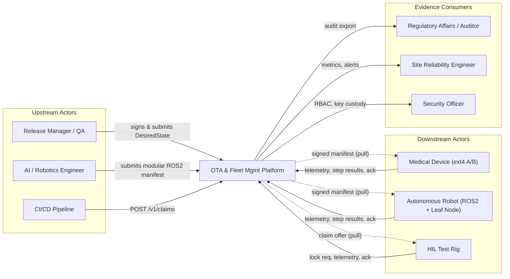
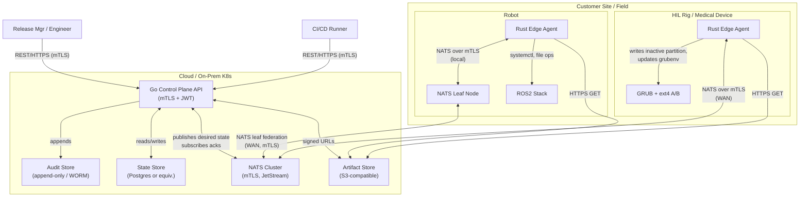

# 3. System Scope and Context

## 3.1 Business Context

The platform mediates between **upstream actors** (release managers, CI pipelines, robotics engineers) who *request* state changes, and **downstream actors** (devices, robots, HIL rigs) that *realize* those changes. Regulators and operators consume the resulting evidence.

### External Interface Inventory (Business)

| Counterparty | Direction | Interface | Purpose |
|--------------|-----------|-----------|---------|
| Release Manager | inbound | Control plane REST API + UI | Submit signed `DesiredState`. |
| AI / Robotics Engineer | inbound | Control plane REST API | Submit application-only modular flow. |
| CI/CD Pipeline | inbound | `POST /v1/claims`, polling `GET /v1/claims/{id}` | Reserve hardware. |
| Regulator / Auditor | inbound | `GET /v1/audit/export` | Pull tamper-evident evidence. |
| Devices / Robots / Rigs | outbound (from device perspective) | NATS request-reply, NATS publish | Pull desired state, publish telemetry & acks. |

## 3.2 Technical Context

### External Interface Inventory (Technical)

| Interface | Protocol / Format | Authentication | Notes |
|-----------|-------------------|----------------|-------|
| Control Plane REST API | HTTPS / JSON | mTLS + JWT (RBAC) | Entry point for humans and pipelines. |
| Device ↔ NATS | NATS over TLS | mTLS (per-device cert) | All device traffic is pull or device-publish. |
| Device ↔ Artifact Store | HTTPS GET | Pre-signed URL (short-lived) | Resumable via HTTP `Range` (NFR-07). |
| Leaf Node ↔ NATS Hub | NATS leaf federation, TLS | mTLS | Survives WAN drops; buffers locally. |
| Audit Export | HTTPS / JSON or NDJSON | mTLS + JWT (auditor role) | Read-only; tamper-evident hash chain. |

## 3.3 What is Inside the System

- The Go control plane (API, Claim Registry, Audit, RBAC, State Store coordination).
- The NATS cluster configuration, mTLS PKI for messaging.
- The Rust edge agent (NATS client, manifest verifier, execution engine, partition manager, GRUB manager, telemetry, self-updater).
- The signed manifest schema (Protobuf + JWS envelope).
- The bootloader integration (GRUB scripts, `grubenv` variables, boot-counter).

## 3.4 What is Explicitly Outside the System (v1)

- **HSM-backed signing key custody** (deferred to v2; v1 uses filesystem-stored keys with strict ACLs).
- **Hardware-rooted attestation (TPM measured boot)** — out of scope; revisit if regulator pushes.
- **Multi-region active-active control plane** — single-region active/standby acceptable for v1.
- **Localization** — English-only.
- **End-to-end ROS2 message tunneling over WAN** — robots use Leaf Node for local DDS only; cross-site ROS2 is not a goal.
- **Patient data ingestion of any kind.**

## 3.5 Use Case Mapping

| External Trigger | Use Case |
|------------------|----------|
| Release Manager submits signed manifest for production fleet | [UC-01](../use-cases/UC-01-ab-ota-medical.md) |
| Engineer submits ROS2 modular manifest to a robot | [UC-02](../use-cases/UC-02-ros2-modular-deploy.md) |
| Pipeline POSTs `/v1/claims` for HIL rigs | [UC-03](../use-cases/UC-03-cicd-hil-claiming.md) |
