# 4. Solution Strategy

The architecture is built on a small set of **load-bearing decisions**. Each row below summarizes one such decision, the goal it serves, and the ADR where the trade-off is documented in detail.

## 4.1 Strategy Summary Table

| # | Decision | Primary Goal Served | Trade-off / ADR |
|---|----------|---------------------|-----------------|
| 1 | **Pull-based agent over NATS request-reply.** Agents poll for desired state and claim offers; control plane never opens connections to devices. | Operational simplicity at the edge; zero inbound ports (TC-02). | Higher control-plane fanout cost. → [ADR-0001](../adr/ADR-0001-nats-over-http-rest.md), [ADR-0005](../adr/ADR-0005-pull-based-claim-model.md) |
| 2 | **NATS Leaf Nodes on robots/sites.** Local-first DDS-style traffic; transparent reconnect to hub. | Robot autonomy during cloud outages (NFR-06). | Operational complexity of leaf certs and disk buffers. → [ADR-0001](../adr/ADR-0001-nats-over-http-rest.md) |
| 3 | **Rust for the edge agent.** Single statically linked musl binary; no `unsafe` outside reviewed FFI. | Memory safety (NFR-02), tiny footprint (NFR-03, NFR-10). | Smaller talent pool than Go/Python for ops. → [ADR-0002](../adr/ADR-0002-rust-for-edge-agent.md) |
| 4 | **JWS envelopes with Ed25519 signatures over canonicalized (JCS) JSON payloads.** | Cryptographic verification before execution (FR-10); **human-debuggable** manifests that auditors can read; fast verify on constrained hardware. | Key rotation procedure not yet automated; JCS discipline required. → [ADR-0003](../adr/ADR-0003-jws-ed25519-manifests.md) |
| 5 | **ext4 A/B partitioning + GRUB `grubenv` boot-counter** as a *reference device profile*. Btrfs snapshot variant as an alternate profile. **Neither is compiled into the agent** — both are expressed as signed manifest scripts. | Un-brickability (Quality Goal #1); FR-03..FR-06, FR-20. | A/B doubles root-filesystem size on disk; device profiles must be authored and reviewed. → [ADR-0004](../adr/ADR-0004-ab-partitioning-grubenv.md) |
| 6 | **Config-driven primitive execution engine** in the agent. A fixed, finite set of generic primitives (`SCRIPT_EXECUTION`, `FILE_TRANSFER`, `SYSTEM_SERVICE`, `DOCKER_CONTAINER`, `AGENT_SELF_UPDATE`, `REBOOT`). OS-specific intelligence (bootloader, partitioning, Btrfs vs ext4) is delivered as **signed scripts inside the manifest**, not compiled into the agent. Halt-and-rollback on any non-zero. | The same Rust binary runs on Yocto / Ubuntu / Debian (NFR-15). Workflow changes (ext4→Btrfs migration, systemd-boot adoption) no longer require an agent release (FR-01, FR-24, UC-02). | Responsibility for correctness shifts to manifest authors; need a signed device-profile script library. → [ADR-0008](../adr/ADR-0008-config-driven-primitive-engine.md) |
| 7 | **Asynchronous Claim Registry** with optimistic-concurrency lock + TTL. | CI/CD HIL workflows (UC-03); fairness (NFR-09); bounded force-release (NFR-08). | Pipeline must implement polling. → [ADR-0005](../adr/ADR-0005-pull-based-claim-model.md) |
| 8 | **SELinux strict policy** (`ota_agent.pp`) with `type_transition` rules on the staging directory, no `execmem`, no runtime domain transitions. | Defence in depth on the device (NFR-12); the config-driven engine is **compatible** with a locked-down MAC profile because primitives fork/exec against statically labeled artifacts. | Per-distro policy maintenance burden. → [ADR-0006](../adr/ADR-0006-selinux-strict-policy.md) |
| 9 | **Two-factor NATS authentication: mTLS + NATS NKey.** | Zero-Trust posture (NFR-11); CA compromise does not alone authorize device traffic; Ed25519 keys align with the signing-key family. | Two identity systems to operate. → [ADR-0009](../adr/ADR-0009-nats-nkey-authentication.md) |
| 10 | **OpenTelemetry-compatible telemetry over NATS.** | Vendor-neutral observability (FR-18, NFR-14); backends can be Prometheus/Tempo/Loki, or any OTLP-compatible sink. | Additional encoding step vs. a proprietary telemetry schema. → [§08.2](08-crosscutting-concepts.md#82-observability) |
| 11 | **Append-only / WORM audit storage** with cryptographic device acks chained per deployment. | Compliance traceability (NFR-01, NFR-13, FR-11, FR-12). | Storage growth; tooling for audit export needed. → described in [§08](08-crosscutting-concepts.md#audit) |
| 12 | **Cloud-agnostic K8s deployment** with no managed-service dependencies. | Portability (NFR-14). | Operators must run Postgres, NATS, object store themselves. → described in [§07](07-deployment-view.md) |
| 13 | **Anti-rollback** via manifest-declared `lower_limit_version` + device-persisted monotonic `max_seen_version` in tamper-resistant storage (TPM NV index preferred). Downgrades require a distinct `downgrade`-capability signing key. | Closes signed-replay attack; enforces staged migration (FR-25, FR-26, NFR-16). | Second signing-key role + TPM provisioning cost. → [ADR-0010](../adr/ADR-0010-anti-rollback-enforcement.md) |
| 14 | **Offline / air-gapped update bundle.** Deterministic zip containing `manifest.jws` + `artifacts/`; `bundle://` URL scheme shares the entire online verification and execution path. | Air-gapped medical manufacturing, HIL labs behind data diodes, disconnected field service (FR-27, NFR-06). | Bundle determinism discipline; physical-access trust considerations. → [ADR-0011](../adr/ADR-0011-offline-bundle-format.md) |
| 15 | **Single root-of-trust manifest with top-level artifact pin index** (`artifacts[]`). One JWS verify → N cheap SHA-256 checks for everything the manifest references. | Consistent integrity across online & offline paths; catches mirror-drift failures (FR-29). | Pipeline must keep `artifacts[]` in sync with step references (CI-enforced). → [§5.8](05-building-block-view.md#58-jws-manifest-envelope-adr-0003--adr-0008) |
| 16 | **Capability-gated steps (`applies_if`).** One manifest targets heterogeneous fleets; steps skip cleanly when the device lacks the predicate. | Hot-pluggable accessories, mixed device profiles, single-release-per-fleet (FR-28). | Tiny predicate grammar must be kept deliberately closed. → [§5.4.1](05-building-block-view.md#541-manifest--json-schema-sketch-jws-payload) |

## 4.2 Strategy Diagram

```mermaid
flowchart TB
    Goals["Quality Goals\n1. Un-brickability\n2. Traceability\n3. Edge simplicity\n4. Hardware Portability\n5. Offline Capability\n6. Anti-Rollback"]

    subgraph approach [Strategy]
        Pull["Pull-only NATS\n(req-reply + leaf nodes)"]
        Rust["Rust agent\n(single static musl)"]
        JWS["JWS + Ed25519\nover JSON (JCS)"]
        AB["ext4 A/B + grubenv\n(as device-profile scripts)"]
        Config["Config-driven primitives\n(dumb agent, scripted OS)"]
        Claim["Async Claim Registry\nopt. concurrency + TTL"]
        SELinux["SELinux strict\ntype_transition + no execmem"]
        NKey["mTLS + NATS NKey\n(two-factor NATS auth)"]
        OTel["OpenTelemetry over NATS"]
        WORM["Append-only audit\n+ device crypto-ack"]
        Rollback["Anti-rollback\nlower_limit + TPM NV index"]
        Offline["Offline bundle\nbundle:// transport"]
        Pin["Single root-of-trust\nartifacts[] pin index"]
        Applies["applies_if predicate\n(capability gating)"]
    end

    Goals --> Pull
    Goals --> Rust
    Goals --> JWS
    Goals --> AB
    Goals --> Config
    Goals --> Claim
    Goals --> SELinux
    Goals --> NKey
    Goals --> OTel
    Goals --> WORM
    Goals --> Rollback
    Goals --> Offline
    Goals --> Pin
    Goals --> Applies
```

## 4.3 Why Not Alternatives (Briefly)

- **Why not push (gRPC server-streaming to devices)?** Requires devices to expose endpoints or maintain long-lived inbound-tunneled state; defeats TC-02 and complicates NAT traversal. Pull keeps the device a pure client.
- **Why not Kafka instead of NATS?** Kafka excels at log-style high-throughput analytics; NATS is purpose-built for low-latency request-reply and Leaf Node WAN federation, which is exactly the device-agent pattern.
- **Why not OSTree / Mender / RAUC instead of A/B + GRUB?** Those are valid, but the brief mandates GRUB integration and the ability to operate on bare ext4. A/B + `grubenv` is our *reference device profile*; because it is expressed as scripts in the manifest, OSTree/Mender/RAUC can be introduced as alternate profiles without touching the agent.
- **Why not push images via Docker/OCI exclusively?** Modular flows must support kernel-level updates on devices that may not run a container runtime at all. Docker is one primitive among several.
- **Why not compiled-in OS-specific step types (earlier draft)?** Hardcoding GRUB / ext4 into the agent violates Open-Closed and forces an agent release for every new hardware profile. See [ADR-0008](../adr/ADR-0008-config-driven-primitive-engine.md).
- **Why not mTLS alone for NATS?** One identity factor; CA compromise is single point of failure; see [ADR-0009](../adr/ADR-0009-nats-nkey-authentication.md).
- **Why not RSA / ECDSA P-256 for signing?** Ed25519 has smaller signatures, deterministic signing (no nonce footgun), and is fast on ARM cores without crypto accelerators.
- **Why not rely on `deployment_id` de-duplication for anti-rollback?** An attacker can re-publish an old artifact with a *new* `deployment_id` under a valid signature. Only a monotonic version counter defeats this — see [ADR-0010](../adr/ADR-0010-anti-rollback-enforcement.md).
- **Why not a proprietary binary container (Bambu-style BIMH) for offline bundles?** Duplicates JWS in a new format; not human-inspectable. We keep a single signing/verification surface (JWS over JCS JSON) across online and offline paths — see [ADR-0011](../adr/ADR-0011-offline-bundle-format.md).
- **Why not full TUF metadata (root/targets/snapshot/timestamp)?** Valuable in broad mirror-network ecosystems; overkill for our single-signer-per-release model. We adopt TUF's core principle (one signed root, cheap per-artifact pins) without the full role framework. Revisit in v2.
