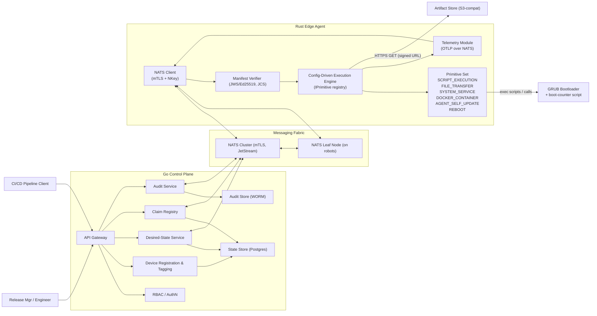
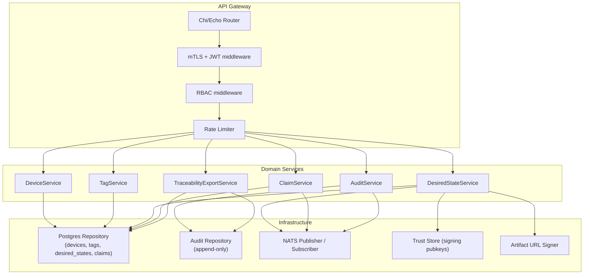
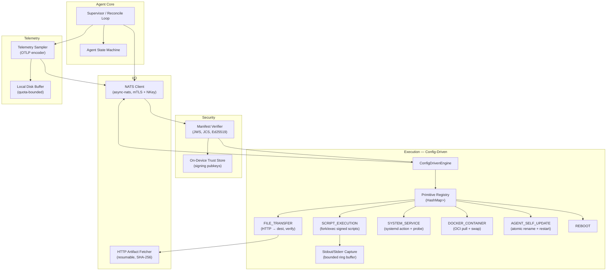
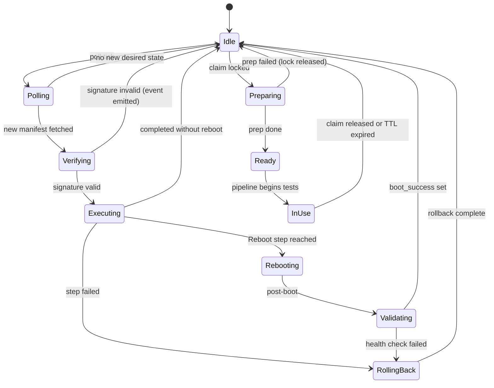
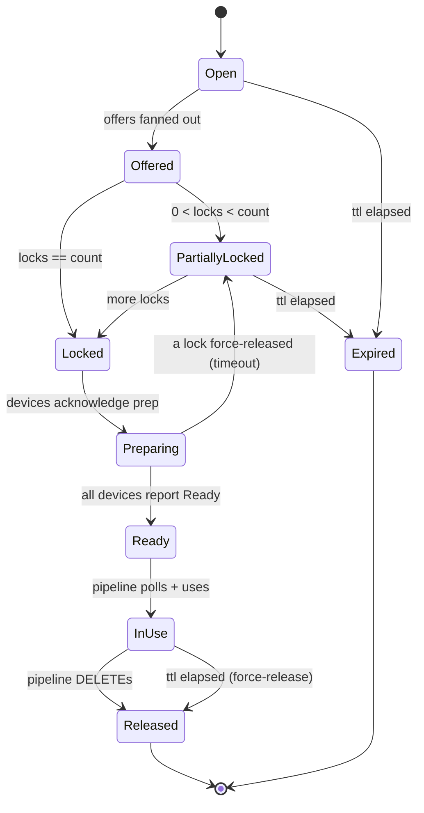
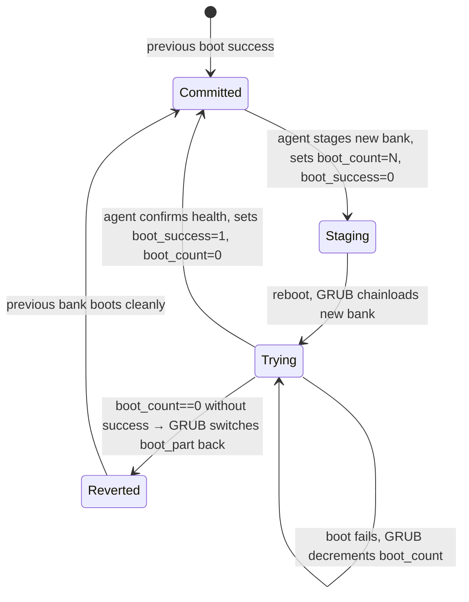

# 5. Building Block View

This section decomposes the system into building blocks and specifies their **interfaces** with medium-depth detail: Protobuf message sketches, NATS subject hierarchy, Go REST endpoint signatures, on-disk layout, state machines, and the JWS envelope shape.

> **Note.** Code-level artifacts (`.proto` files, Go interface declarations, Rust trait definitions) are *sketches* here; full source materializes in the implementation phase.

---

## 5.1 Level 1 — System Decomposition (Whitebox)



### Level-1 Block Catalogue

| Block | Responsibility | Interfaces |
|-------|----------------|------------|
| **API Gateway** | Terminate mTLS, route to internal services, enforce RBAC. | REST/HTTPS to clients, gRPC/in-proc to internal services. |
| **Device Registration & Tagging** | CRUD devices, manage tags. | REST + Postgres. |
| **Desired-State Service** | Stores latest signed `DesiredState` per device/tag; serves on NATS request. | REST + NATS. |
| **Claim Registry** | Asynchronous reservations with TTL + optimistic-concurrency lock. | REST + NATS. |
| **Audit Service** | Append-only deployment audit; export endpoint. | REST + Audit Store. |
| **RBAC / AuthN** | Validate JWT, map principals to roles. | In-proc to all services. |
| **State Store** | Postgres schema for devices, tags, desired states, claims. | SQL. |
| **Audit Store** | Append-only / WORM (e.g., S3 with object-lock or WORM-compliant DB). | Object/SQL. |
| **NATS Cluster** | mTLS-secured fabric with JetStream. | NATS protocol. |
| **NATS Leaf Node** | Edge-local NATS instance federating to hub; buffers when WAN drops. | NATS protocol. |
| **NATS Client (agent)** | Connect (mTLS + NKey — [ADR-0009](../adr/ADR-0009-nats-nkey-authentication.md)), subscribe, request-reply, publish. | Embedded in agent. |
| **Manifest Verifier** | Validate JWS envelope, JCS canonicalization, Ed25519 signature; check `kid` against trust store. | Internal. |
| **Config-Driven Execution Engine** | Look up the primitive named in each step in the registry; validate params; fork/exec or in-process execute; capture results; halt-and-rollback. | `IPrimitive` trait (see [ADR-0008](../adr/ADR-0008-config-driven-primitive-engine.md)). |
| **Primitive Set** | Fixed, finite collection of capabilities the agent can perform. OS-specific intelligence is **not** here — it lives in signed manifest scripts. | See [§5.4.1](#541-manifest--json-schema-sketch-jws-payload) primitive table. |
| **Telemetry Module** | OTLP-encoded metrics + logs published over NATS ([§8.2](08-crosscutting-concepts.md#82-observability)). | Vendor-neutral. |
| **GRUB Bootloader** | Chainload selected partition; run boot-counter script. Agent interacts with `grubenv` only via SCRIPT_EXECUTION of device-profile scripts. | OS. |
| **Artifact Store** | Hosts signed update artifacts + device-profile scripts; serves via pre-signed URLs. | HTTPS. |

---

## 5.2 Level 2 — Go Control Plane (Whitebox)



### Service Responsibilities

| Service | Responsibility |
|---------|----------------|
| `DeviceService` | Register, list, retire devices; manage device public keys; mTLS bootstrap. |
| `TagService` | CRUD tags; assign/remove tags from devices; enforce tag namespace conventions. |
| `DesiredStateService` | Accept signed `DesiredState`, persist, publish availability, serve on NATS request. |
| `ClaimService` | Create, list, lock, release, expire claims; emit offers; arbitrate locks. |
| `AuditService` | Persist deployment events and crypto-acks; expose audit query endpoints. |
| `TraceabilityExportService` | Generate IEC 62304 evidence packages joining requests, devices, acks. |

---

## 5.3 Level 2 — Rust Edge Agent (Whitebox)



### Agent Module Responsibilities

| Module | Responsibility | Notes |
|--------|----------------|-------|
| `Supervisor` | Top-level Tokio runtime; orchestrates loops, signals, graceful shutdown. | Single entry point. |
| `Agent State Machine` | Owns transitions; see §5.7. | |
| `NATS Client` | Connect with mTLS **+** NATS NKey ([ADR-0009](../adr/ADR-0009-nats-nkey-authentication.md)); reconnect/backoff; request-reply; publish. | `async-nats`. |
| `HTTP Artifact Fetcher` | GET with `Range` resume, stream-to-file, SHA-256 verify. Shared primitive infrastructure. | Used by `FILE_TRANSFER` and `AGENT_SELF_UPDATE`. |
| `Manifest Verifier` | Validate JWS header (`alg=EdDSA`, `kid`); re-canonicalize payload via JCS (RFC 8785); verify Ed25519 signature against trust store. | Trust store is an on-device PEM directory. |
| `ConfigDrivenEngine` | Walks `deployment_steps`; looks up primitive in registry; runs rollback on failure; publishes results. | See [ADR-0008](../adr/ADR-0008-config-driven-primitive-engine.md). |
| `Primitive Registry` | Compile-time mapping from primitive name → `Arc<dyn Primitive>`. | Only touchpoint for adding capabilities. |
| `SCRIPT_EXECUTION` primitive | fork/exec a signed script (SHA-256 verified) against an SELinux-labeled staging directory; bounded stdout/stderr capture. | FR-01, FR-21, FR-24. |
| `FILE_TRANSFER` primitive | Resumable HTTPS download with checksum verify. | NFR-07. |
| `SYSTEM_SERVICE` primitive | `systemctl` action + readiness probe. | FR-13. |
| `DOCKER_CONTAINER` primitive | OCI image pull by digest; atomic container swap via engine API. | FR-23. |
| `AGENT_SELF_UPDATE` primitive | Stage new binary, verify signature, atomic `rename(2)`, `systemctl restart ota-agent`. | FR-19. |
| `REBOOT` primitive | Controlled reboot with grace period. | |
| `Stdout/Stderr Capture` | Bounded ring buffer (default 1 MiB/stream/step) with truncation marker. | FR-21. |
| `Telemetry Sampler` | Periodic snapshot of system + agent metrics, OTLP-encoded, published over NATS ([§8.2](08-crosscutting-concepts.md#82-observability)). | FR-18, vendor-neutral. |

---

## 5.4 Detailed Design — Contract Sketches

> Per [ADR-0008](../adr/ADR-0008-config-driven-primitive-engine.md) the agent is a **generic primitive executor**; OS-specific logic (A/B flashing, `grubenv` toggling, Btrfs snapshots) is delivered as **signed scripts** inside the manifest, not as compiled-in step variants.
>
> **Two complementary wire formats** coexist (both ultimately sit on NATS):
>
> - **Manifests** are **JSON** wrapped in JWS ([ADR-0003](../adr/ADR-0003-jws-ed25519-manifests.md)). Human-debuggable, primitive-extensible.
> - **Machine messages** (telemetry, heartbeats, step results, claim messages, acks) remain **Protobuf** ([ADR-0007](../adr/ADR-0007-protobuf-contracts.md)). Compact, schema-stable, high-volume.

### 5.4.1 Manifest — JSON Schema Sketch (JWS Payload)

```json
{
  "schema_version": 1,
  "deployment_id": "5f2b…-uuid",
  "target_serial": "ABC123",
  "target_tag": null,

  "desired_version": "2.4.0",
  "lower_limit_version": "2.0.0",
  "allow_downgrade": false,
  "downgrade_justification": null,

  "issued_at": "2026-04-21T12:34:56Z",
  "requested_by": "release-manager-alice@example.org",

  "artifacts": [
    { "name": "root-v2.4.img",                  "sha256": "ab12…", "size": 268435456 },
    { "name": "flash-inactive-partition.sh",    "sha256": "cd34…", "size": 4096     },
    { "name": "update-grubenv.sh",              "sha256": "ef56…", "size": 1024     },
    { "name": "restore-grubenv.sh",             "sha256": "78ab…", "size": 1024     }
  ],

  "deployment_steps": [
    {
      "step_id": "01-download",
      "description": "Fetch new root image",
      "primitive": "FILE_TRANSFER",
      "applies_if": null,
      "parameters": {
        "url": "https://artifacts.example.org/root-v2.4.img?sig=...",
        "sha256": "ab12...",
        "dest_path": "/var/lib/ota/spool/root-v2.4.img",
        "resumable": true
      },
      "timeout_seconds": 1800,
      "continue_on_error": false
    },
    {
      "step_id": "02-flash",
      "description": "Write image to inactive bank (device profile script)",
      "primitive": "SCRIPT_EXECUTION",
      "applies_if": { "has_tag": "ext4-ab" },
      "parameters": {
        "interpreter": "/bin/bash",
        "script_ref": "device-profiles/x86-ext4-ab/flash-inactive-partition.sh",
        "script_sha256": "cd34...",
        "env": { "IMG_PATH": "/var/lib/ota/spool/root-v2.4.img" },
        "working_dir": "/var/lib/ota/spool"
      },
      "timeout_seconds": 900
    },
    {
      "step_id": "03-grubenv",
      "description": "Toggle boot target via device profile script",
      "primitive": "SCRIPT_EXECUTION",
      "applies_if": { "has_tag": "ext4-ab" },
      "parameters": {
        "interpreter": "/bin/bash",
        "script_ref": "device-profiles/x86-ext4-ab/update-grubenv.sh",
        "script_sha256": "ef56...",
        "env": { "BOOT_PART": "B", "BOOT_COUNT": "3" }
      },
      "timeout_seconds": 30
    },
    {
      "step_id": "04-reboot",
      "primitive": "REBOOT",
      "parameters": { "grace_seconds": 30 }
    }
  ],
  "rollback_steps": [
    {
      "step_id": "r1-restore-grubenv",
      "primitive": "SCRIPT_EXECUTION",
      "applies_if": { "has_tag": "ext4-ab" },
      "parameters": {
        "interpreter": "/bin/bash",
        "script_ref": "device-profiles/x86-ext4-ab/restore-grubenv.sh",
        "script_sha256": "78ab..."
      },
      "timeout_seconds": 30
    }
  ]
}
```

**Top-level fields (new in v1):**

| Field | Purpose | Reference |
|-------|---------|-----------|
| `desired_version` | Monotonic semver of the resulting device software state. Enforced as anti-rollback gate. | [ADR-0010](../adr/ADR-0010-anti-rollback-enforcement.md), [FR-25](../requirements/functional.md#fr-25--anti-rollback-version-monotonicity) |
| `lower_limit_version` | Minimum `current_deployed_version` on the device; manifests rejected if device is older. Enables staged migrations. | [FR-26](../requirements/functional.md#fr-26--lower_limit_version-gating) |
| `allow_downgrade` / `downgrade_justification` | Explicit opt-in + rationale required to install a version lower than `max_seen_version`. Must be signed by a `downgrade`-capability key. | [ADR-0010](../adr/ADR-0010-anti-rollback-enforcement.md) |
| `artifacts[]` | Single root-of-trust pin index: every file referenced by any step's `url` or `script_ref` MUST appear here with its SHA-256. One signature gates N cheap hash checks. | [FR-29](../requirements/functional.md#fr-29--manifest-level-artifact-pin-index), pattern from Bambu `ota-package-list.json`. |
| `applies_if` (per step) | Capability/predicate gate; step is skipped (not failed) if the predicate evaluates false against the device's observed state. Supports hot-pluggable accessories and mixed-profile fleets. | [FR-28](../requirements/functional.md#fr-28--conditional-step-execution-applies_if-predicate) |

**`applies_if` predicate grammar (v1, intentionally tiny):**

```json
{ "has_tag": "ros2-hil" }
{ "has_capability": "docker" }
{ "device_profile": "x86-ext4-ab" }
{ "all_of": [ {"has_tag": "ros2"}, {"has_capability": "docker"} ] }
{ "any_of": [ {"device_profile": "x86-ext4-ab"}, {"device_profile": "arm-btrfs"} ] }
{ "not": { "has_tag": "factory-mode" } }
```

No Turing-complete expressions; no external references; evaluable against a static snapshot of the device's reported state. Unknown predicate kind → manifest rejected (fail-closed).

**Primitive set (v1)** — the complete, fixed inventory the agent implements:

| `primitive` | Purpose | Required parameters |
|-------------|---------|---------------------|
| `SCRIPT_EXECUTION` | Fork/exec a signed script from the manifest. | `interpreter`, `script_ref` or `script_body`, `script_sha256`, optional `env`, `working_dir` |
| `FILE_TRANSFER` | Resumable HTTPS download with SHA-256 verify. | `url`, `sha256`, `dest_path`, `resumable` (bool) |
| `SYSTEM_SERVICE` | systemd unit `start`/`stop`/`restart` with readiness probe. | `unit_name`, `action`, optional `readiness_timeout_seconds`, `readiness_probe` |
| `DOCKER_CONTAINER` | Pull OCI image by digest, then either cache it for a coordinated cutover or swap a single container atomically. *(FR-23)* | `image_ref`, `image_digest`, `mode`, optional `container_name`, `args`, `networks`, `volumes` |
| `AGENT_SELF_UPDATE` | Atomic binary swap + `systemctl restart ota-agent`. *(FR-19)* | `url`, `sha256`, `target_architecture`, `binary_signature` |
| `REBOOT` | Controlled reboot. | `grace_seconds` |

A **new primitive is a compile-time addition** to the agent (schema update + registry entry + SELinux policy rule). **New workflows** (Btrfs rollback, systemd-boot toggling, UKI staging) are **manifest-only changes** composing the existing primitives.

### 5.4.2 JSON Canonicalization & Verification

- Manifests are serialized with **JCS (RFC 8785)** before Base64URL encoding and signing. Verifiers re-canonicalize after decode.
- `manifest_hash = SHA-256(BASE64URL(jcs_payload))` is used for ack binding ([§5.4.4 DeploymentAck](#544-machine-messages--protobuf)).
- Script bodies referenced by `script_ref` are fetched from the artifact store; their `script_sha256` in the manifest is verified before execution. An alternative `script_body` field (base64url-encoded bytes, bounded size) inlines small scripts.

### 5.4.3 IPrimitive Trait (Rust sketch)

```rust
// Strategy + Command pattern — see ADR-0008
pub trait Primitive: Send + Sync {
    fn name(&self) -> &'static str;                 // e.g. "SCRIPT_EXECUTION"
    fn validate(&self, params: &StepParams) -> Result<(), ValidationError>;
    fn execute(&self, ctx: &ExecCtx, params: &StepParams) -> Result<StepResult, StepError>;
}

pub struct ConfigDrivenEngine {
    registry: HashMap<&'static str, Arc<dyn Primitive>>,
    verifier: ManifestVerifier,
    publisher: StepResultPublisher,
}

impl ConfigDrivenEngine {
    pub fn run(&self, signed: SignedManifest) -> ManifestOutcome {
        let manifest = self.verifier.verify(&signed)?;            // JWS + JCS + kid lookup
        for (idx, step) in manifest.deployment_steps.iter().enumerate() {
            let p = self.registry.get(step.primitive.as_str())
                .ok_or(EngineError::UnknownPrimitive)?;
            p.validate(&step.parameters)?;
            let res = p.execute(&self.ctx, &step.parameters)?;
            self.publisher.publish(&res)?;
            if !res.success && !step.continue_on_error {
                return self.run_rollback(&manifest);
            }
        }
        Ok(ManifestOutcome::Success)
    }
}
```

**Registry population at startup** is the only code touchpoint when introducing a new primitive: insert one entry and ship a new agent version.

### 5.4.4 Machine Messages — Protobuf

```proto
syntax = "proto3";
package otap.v1;

message Device {
  string serial          = 1;
  repeated string tags   = 2;
  string public_key      = 3;             // device Ed25519 pubkey (for Ack + NKey)
  string nats_nkey       = 4;             // NATS NKey public (ADR-0009)
  string agent_version   = 5;
  string active_partition = 6;            // informational: "A" | "B" | "btrfs:@-snap-3" | ""
  google.protobuf.Timestamp last_heartbeat = 7;
}

message Heartbeat {
  string serial                = 1;
  string agent_version         = 2;
  AgentState state             = 3;
  string active_partition      = 4;
  string current_deployment_id = 5;
  google.protobuf.Timestamp at = 6;
}

enum AgentState {
  AGENT_STATE_UNSPECIFIED  = 0;
  AGENT_STATE_IDLE         = 1;
  AGENT_STATE_POLLING      = 2;
  AGENT_STATE_VERIFYING    = 3;
  AGENT_STATE_EXECUTING    = 4;
  AGENT_STATE_REBOOTING    = 5;
  AGENT_STATE_VALIDATING   = 6;
  AGENT_STATE_ROLLING_BACK = 7;
  AGENT_STATE_PREPARING    = 8;
  AGENT_STATE_READY        = 9;
  AGENT_STATE_IN_USE       = 10;
}

// Telemetry uses OpenTelemetry-compatible semantics (see §8.2); this Protobuf
// message is a thin wrapping for NATS subject binding.
message Telemetry {
  string serial                = 1;
  google.protobuf.Timestamp at = 2;
  bytes  otlp_payload          = 3;       // OTLP-encoded metrics / logs payload
  string agent_version         = 4;
  string current_deployment_id = 5;
}

message StepResult {
  string deployment_id           = 1;
  string step_id                 = 2;
  uint32 step_index              = 3;
  string primitive               = 4;     // e.g. "SCRIPT_EXECUTION"
  bool   success                 = 5;
  int32  exit_code               = 6;
  string stdout_truncated        = 7;
  string stderr_truncated        = 8;
  bool   stdout_truncated_marker = 9;
  bool   stderr_truncated_marker = 10;
  google.protobuf.Duration duration = 11;
  google.protobuf.Timestamp at   = 12;
}

message DeploymentAck {
  string deployment_id   = 1;
  string device_serial   = 2;
  string manifest_hash   = 3;             // SHA-256 of JCS(payload) — matches §5.4.2
  string deployed_version = 4;
  google.protobuf.Timestamp at = 5;
  bytes  agent_signature = 6;             // Ed25519 over (deployment_id|serial|hash|version|at)
}

message ClaimRequest {
  string claim_id                   = 1;
  uint32 count                      = 2;
  repeated string required_tags     = 3;
  string desired_version            = 4;
  uint32 ttl_seconds                = 5;
  uint32 preparation_timeout_seconds = 6;
  string requested_by               = 7;
}

message ClaimOffer {
  string claim_id               = 1;
  repeated string required_tags = 2;
  string desired_version        = 3;
  uint32 slots_remaining        = 4;
  google.protobuf.Timestamp expires_at = 5;
}

message ClaimLock {
  string claim_id   = 1;
  string serial     = 2;
  uint64 attempt_id = 3;
}

message ClaimLockReply {
  bool   granted                     = 1;
  string lease_id                    = 2;
  uint32 preparation_timeout_seconds = 3;
}
```

**Compatibility plan:** all fields are optional (proto3 default); reserved field numbers will be allocated when fields are deprecated; manifest `schema_version` is the break-glass for JSON-schema evolution; Protobuf evolution is governed by `buf breaking` in CI.

---

## 5.5 Detailed Design — NATS Subject Hierarchy

| Subject | Direction | Pattern | Purpose | Auth |
|---------|-----------|---------|---------|------|
| `device.<serial>.desired-state` | device → server | request-reply | Pull current desired state for this device. | mTLS device cert + subject ACL: device may only request its own. |
| `device.<serial>.heartbeat` | device → server | publish | Periodic liveness; carries `AgentState`. | mTLS, ACL self-only. |
| `device.<serial>.telemetry` | device → server | publish (JetStream) | Structured metrics. | mTLS, ACL self-only. |
| `device.<serial>.step-result` | device → server | publish (JetStream) | Per-step result during deployment. | mTLS, ACL self-only. |
| `device.<serial>.ack` | device → server | publish (JetStream) | Cryptographic deployment acknowledgment. | mTLS, ACL self-only. |
| `claim.offer.<tag>` | server → devices | publish (fan-out) | Notify idle agents matching a tag. | mTLS, ACL: subscribe permitted when device has tag. |
| `claim.lock.<claim_id>` | device → server | request-reply | Attempt to lock a claim slot. | mTLS, RBAC enforced server-side. |
| `claim.release.<claim_id>` | server → device | publish | Notify locked devices that the claim is released. | mTLS. |
| `audit.deployment.<deployment_id>` | server-internal | publish (JetStream) | Internal audit fanout for indexing. | server-only. |
| `agent.self-update.<serial>` | server → device | request-reply on demand | Trigger and track agent self-update. | mTLS + RBAC. |

**Subject ACL rule of thumb:** every subject containing `<serial>` is bound to that device's identity; every subject containing `<tag>` is restricted to devices possessing the tag at registration time (re-evaluated on tag change).

---

## 5.6 Detailed Design — Go REST API Surface

All endpoints mTLS + JWT, `Content-Type: application/json`. Versioned under `/v1`. Sketches; full OpenAPI in implementation.

### Devices & Tags

| Method | Path | Body / Query | Returns | RBAC role |
|--------|------|--------------|---------|-----------|
| `POST` | `/v1/devices` | `{serial, public_key, initial_tags?}` | `201 {device}` | `device:register` |
| `GET`  | `/v1/devices/{serial}` | — | `200 {device}` | `device:read` |
| `GET`  | `/v1/devices?tag=ros2-hil&tag=x86` | tag filter (AND) | `200 [{device},...]` | `device:read` |
| `PATCH`| `/v1/devices/{serial}/tags` | `{add: [...], remove: [...]}` | `200 {device}` | `device:tag` |
| `POST` | `/v1/devices/{serial}/retire` | `{reason}` | `204` | `device:retire` |

### Desired State

| Method | Path | Body | Returns | RBAC |
|--------|------|------|---------|------|
| `PUT`  | `/v1/desired-state/by-serial/{serial}` | `{jws_envelope}` (Protobuf payload base64url) | `202 {deployment_id}` | `release:publish` |
| `PUT`  | `/v1/desired-state/by-tag/{tag}`       | `{jws_envelope}`                              | `202 {deployment_id, target_count}` | `release:publish` |
| `GET`  | `/v1/desired-state/{deployment_id}`    | — | `200 {deployment, per_device_status}` | `release:read` |

### Claims

| Method | Path | Body | Returns | RBAC |
|--------|------|------|---------|------|
| `POST` | `/v1/claims` | `ClaimRequest` (JSON) | `201 {claim_id, status: "Open"}` | `pipeline:create-claim` |
| `GET`  | `/v1/claims/{claim_id}` | — | `200 {claim, devices:[{serial,state,last_update}]}` (FR-17) | `pipeline:read-claim` |
| `DELETE`| `/v1/claims/{claim_id}` | — | `204` | `pipeline:create-claim` |

### Audit / Traceability

| Method | Path | Query | Returns | RBAC |
|--------|------|-------|---------|------|
| `GET`  | `/v1/audit/deployments` | `?from=&to=&device=&deployment_id=` | `200 [audit_record,...]` | `audit:read` |
| `GET`  | `/v1/audit/export`      | `?deployment_id=` | `200 NDJSON` (signed bundle) | `audit:export` |

### Health / Operations

| Method | Path | Returns |
|--------|------|---------|
| `GET`  | `/healthz` | `200 ok` |
| `GET`  | `/readyz`  | `200 ok` (with dependencies) |
| `GET`  | `/metrics` | Prometheus exposition |

**Error model:** RFC 7807 `application/problem+json` everywhere.

---

## 5.7 Detailed Design — State Machines

### 5.7.1 Agent State Machine



### 5.7.2 Claim Lifecycle (server-side)



### 5.7.3 Boot State Machine (governed by GRUB script + agent)



---

## 5.8 Detailed Design — JWS Manifest Envelope

The on-the-wire manifest is a **JWS Compact Serialization** wrapping a **UTF-8 JSON** payload that has been canonicalized per **RFC 8785 (JCS)** before signing. See [ADR-0003](../adr/ADR-0003-jws-ed25519-manifests.md).

```text
BASE64URL(UTF8(JOSE Header)) || '.' || BASE64URL(JCS(JSON(DesiredState))) || '.' || BASE64URL(Signature)
```

JOSE header (sketch):

```json
{
  "alg": "EdDSA",
  "typ": "otap-desired-state+json",
  "kid": "release-mgr-2026-04",
  "ver": 1
}
```

Verification rules in the agent (fail-closed; the first failure aborts the deployment and emits an audit event):

| # | Rule | Refs |
|---|------|------|
| 1 | Header `alg` MUST be `EdDSA`; reject anything else (no algorithm-confusion). | [ADR-0003](../adr/ADR-0003-jws-ed25519-manifests.md) |
| 2 | `kid` MUST resolve in the on-device trust store; unknown `kid` → reject. | [ADR-0003](../adr/ADR-0003-jws-ed25519-manifests.md) |
| 3 | Signature is verified over the encoded header `.` encoded payload (per RFC 7515). | — |
| 4 | Decoded payload MUST parse as JSON conforming to the manifest schema ([§5.4.1](#541-manifest--json-schema-sketch-jws-payload)) with `schema_version` understood. | — |
| 5 | Re-canonicalize the decoded JSON via JCS and ensure it equals the signed bytes (guards against producer bugs). | [ADR-0003](../adr/ADR-0003-jws-ed25519-manifests.md) |
| 6 | Every step's `primitive` MUST be present in the agent's registry; unknown primitive → reject **before** any execution (atomic manifest). | [ADR-0008](../adr/ADR-0008-config-driven-primitive-engine.md) |
| 7 | Every step parameter URL of scheme `bundle://` MUST resolve within the active bundle; every referenced artifact name MUST appear in the top-level `artifacts[]` index. | [ADR-0011](../adr/ADR-0011-offline-bundle-format.md), [FR-29](../requirements/functional.md#fr-29--manifest-level-artifact-pin-index) |
| 8 | Every `script_ref` / `script_body` and every `FILE_TRANSFER` artifact MUST verify against the SHA-256 declared in the step **and** against the matching entry in the `artifacts[]` pin index (both must agree). | [FR-29](../requirements/functional.md#fr-29--manifest-level-artifact-pin-index) |
| 9 | `target_serial` (if set) MUST equal this device's serial; otherwise `target_tag` MUST be one of the device's tags. | — |
| 10 | `semver(current_deployed_version) ≥ semver(lower_limit_version)` → else `REJECTED_BELOW_LOWER_LIMIT`. | [ADR-0010](../adr/ADR-0010-anti-rollback-enforcement.md), [FR-26](../requirements/functional.md#fr-26--lower_limit_version-gating) |
| 11 | `semver(desired_version) ≥ semver(max_seen_version)`, unless `allow_downgrade == true`, `downgrade_justification` is non-empty, **and** `kid` resolves to a key with the `downgrade` capability → else `REJECTED_ROLLBACK`. | [ADR-0010](../adr/ADR-0010-anti-rollback-enforcement.md), [FR-25](../requirements/functional.md#fr-25--anti-rollback-version-monotonicity) |
| 12 | For every step, `applies_if` (if present) is evaluated against the device's observed state. If the predicate evaluates **false**, the step is **skipped** (not failed). Unknown predicate kind → manifest rejected (fail-closed). | [FR-28](../requirements/functional.md#fr-28--conditional-step-execution-applies_if-predicate) |
| 13 | `manifest_hash` for ack purposes is `SHA-256(BASE64URL(JCS payload))`. | — |

**Single root-of-trust property.** One JWS signature + 4 lightweight top-level checks (rules 10–13) gate every subsequent artifact access; individual artifact hashes are then verified via cheap SHA-256 (rules 7–8). This is the Bambu design applied to our JSON+JWS format.

---

## 5.9 Boot-Redundancy Reference Device Profiles

The agent itself is profile-agnostic (see [ADR-0008](../adr/ADR-0008-config-driven-primitive-engine.md)). Un-brickability is achieved by selecting one of the reference device profiles catalogued in [ADR-0004](../adr/ADR-0004-ab-partitioning-grubenv.md); each profile is a library of signed scripts invoked via the `SCRIPT_EXECUTION` primitive. The catalog is deliberately small in v1 — adding a profile requires an ADR amendment.

| Profile | When to use | Active/Inactive unit | Rollback mechanism |
|---------|-------------|----------------------|--------------------|
| `ext4-partition-ab` | Green-field devices where we control partitioning at provisioning | **Partition** (Bank A ↔ Bank B on one disk) | GRUB `grubenv` boot-counter with auto-fallback (multi-attempt) |
| `dual-disk-chainload` | Hardware with two physical disks; each disk is self-contained (bootloader + kernel + rootfs) | **Disk** (`/dev/sda` ↔ `/dev/sdb`) | GRUB `grub-reboot` one-shot `next_entry` + agent post-boot health commit |
| `btrfs-snapshot` | Brownfield Btrfs-rooted devices where a second root partition is impractical | **Subvolume** (`@` ↔ snapshot) | `btrfs subvolume set-default` with agent-driven revert |

### 5.9.1 `ext4-partition-ab` layout

| Partition # | Type | Size (typ.) | Mount | Purpose |
|------------:|------|-------------|-------|---------|
| 1 | EFI System (FAT32) | 512 MiB | `/boot/efi` | GRUB EFI binaries, UKI staging, `grubenv` |
| 2 | Linux Filesystem (ext4) | ≥ 4 GiB | `/` (when active) | Root Bank A |
| 3 | Linux Filesystem (ext4) | ≥ 4 GiB | `/` (when active) | Root Bank B |
| 4 | Linux Filesystem (ext4) | remainder | `/var/lib/persistent` | Persistent device data (logs, telemetry buffer, model cache) |

`grubenv` variables (in `/boot/efi/EFI/.../grubenv`):

| Variable | Values | Owner | Purpose |
|----------|--------|-------|---------|
| `boot_part` | `A` \| `B` | agent (write), GRUB (read) | Which bank GRUB chainloads. |
| `boot_count` | `0..N` | agent (write), GRUB script (decrement) | Tries remaining for the staged bank. |
| `boot_success` | `0` \| `1` | agent (write) | Set by agent post health check. |
| `previous_part` | `A` \| `B` | agent (write) | Used by fallback script to revert. |

### 5.9.2 `dual-disk-chainload` layout (from the field-tested prototype)

Two physical disks; each is an independent bootable system. The primary GRUB (on `/dev/sda`) chainloads the inactive disk for exactly one boot via `grub-reboot`.

| Disk | Role | Contents | Mount (when active) |
|------|------|----------|---------------------|
| `/dev/sda` | Bank A | Primary GRUB (owns `grubenv`), kernel, initramfs, rootfs | `/` |
| `/dev/sdb` | Bank B | Self-contained bootloader + kernel + rootfs | `/` (after chainload) |

`grubenv` variables used by this profile:

| Variable | Values | Owner | Purpose |
|----------|--------|-------|---------|
| `next_entry` | `"Boot from sdb"` \| `"Boot from sda"` | agent (write via `grub-reboot`) | **One-shot** boot selection; cleared after one boot. |
| `saved_entry` | `"Boot from sda"` \| `"Boot from sdb"` | agent (write via `grub-set-default` on health-commit) | Permanent default if `next_entry` is unset. |

**Commit-on-success, revert-on-failure.** If the newly-booted disk reaches health within the deadline, the agent promotes it to `saved_entry`; otherwise the next boot already reverts to `saved_entry` automatically (GRUB clears `next_entry` after using it). This gives single-attempt fallback — weaker than the counter pattern, but simpler and widely compatible. Device classes requiring multi-attempt fallback should use Profile 1.

### 5.9.3 `btrfs-snapshot` layout (FR-20)

- Single root partition with subvolumes: `@`, `@home`, `@var`, `@snapshots/<id>`.
- Update flow: snapshot `@` → mutate (or replace) → set new default subvol → reboot.
- Rollback: GRUB menu entry parameterized by subvol; agent flips on health-check failure.

### 5.9.4 Artifact format agnosticism

Each profile's scripts decide how to turn an **artifact** (fetched via `FILE_TRANSFER`) into a bootable disk/partition/subvolume. The agent itself never parses artifact bytes — any of these are valid artifact formats for a profile script to consume:

| Format | Typical source | Consumption mechanism | Host capability(ies) |
|--------|---------------|-----------------------|--------------------|
| Raw disk / partition image (`.img`) | Hand-built images, `dd`-of-a-reference-device | `dd` | `dd` (baseline) |
| Compressed raw (`.img.xz`, `.img.zst`) | CI pipelines that save bandwidth | Stream-decompress `|` `dd` | `xz` / `zstd` |
| **Yocto `.wic`** (whole image with partition table) | Yocto `image-wic.bbclass` output | `dd` directly, or `bmaptool copy` with a paired `.bmap` for sparse writes | `dd` baseline; `bmaptool` for sparse/efficient path |
| **Yocto `.wic.bz2` / `.wic.gz` / `.wic.xz` / `.wic.zst`** (+ optional `.bmap`) | Yocto default compressed output | `bmaptool copy` handles decompression + sparse write natively; fallback is stream-decompress → `dd` | `bmaptool` (preferred for Yocto); otherwise the matching decompressor |
| Standalone VMDK (`.vmdk`) | Hypervisor-exported golden disk image | Attach VMDK via `qemu-nbd` → `dd` | `qemu-nbd` + `nbd` kernel module |
| VMDK inside an OVA (`.ova`) | Appliance-style hypervisor export | Unpack OVA → attach VMDK via `qemu-nbd` → `dd` | `tar`, `qemu-nbd` + `nbd` kernel module |
| Tarball of a rootfs (`.tar`, `.tar.zst`) | Minimal-rootfs workflows; initramfs-only updates | Format target filesystem → `tar -xpf` into it | `tar`, matching decompressor |
| Debian/Ubuntu offline package set (`.deb` + `Packages*` / `Release`) | Air-gapped app or dependency updates | Stage local repo or package set → `apt-get` / `dpkg -i` via signed script | `apt`, `dpkg` |
| OCI container image | Application updates, Docker/Podman workloads | Pulled and swapped by the `DOCKER_CONTAINER` primitive (§5.4) — not a `SCRIPT_EXECUTION` concern | `docker` or `podman` |

**Yocto .wic + bmaptool note.** `.wic` is Yocto's native "image-with-partition-table" output; paired with a signed `.bmap` file it enables sparse writes via `bmaptool` — skipping empty regions of the image and significantly reducing flash time on eMMC / SD-card / SSD targets. Both the `.wic(.zst|.xz|.gz|.bz2)` **and** the `.bmap` MUST appear in the manifest's top-level `artifacts[]` pin index ([FR-29](../requirements/functional.md#fr-29--manifest-level-artifact-pin-index)), and the script's destructive-operation safety interlock ([FR-30](../requirements/functional.md#fr-30--device-profile-script-authoring-conventions)) still applies to the `bmaptool copy` target. A Yocto-built device class typically declares `bmaptool` as a required capability on its flash step:

```json
{
  "step_id": "02-flash-wic",
  "primitive": "SCRIPT_EXECUTION",
  "applies_if": { "all_of": [
    { "device_profile": "ext4-partition-ab" },
    { "has_capability": "bmaptool" }
  ]},
  "parameters": {
    "interpreter": "/bin/bash",
    "script_ref": "device-profiles/yocto-wic/flash-wic-to-bank.sh",
    "script_sha256": "…",
    "env": {
      "OTA_WIC_PATH": "/var/lib/ota/spool/core-image-v2.4.wic.zst",
      "OTA_BMAP_PATH": "/var/lib/ota/spool/core-image-v2.4.wic.bmap",
      "OTA_TARGET_DEVICE": "/dev/mmcblk0p3",
      "OTA_EXPECTED_TARGET_ROLE": "Bank-B"
    }
  },
  "timeout_seconds": 1800
}
```

The artifact format is a **device-profile concern**, not an agent concern. Adding support for a new format is a new script in a profile library; no agent release.

**Compose-oriented container rollout note.** Multi-service Docker workloads do not require a dedicated new primitive. The manifest can stage a signed `docker-compose.yml` / `.env`, pre-pull each pinned OCI image via `DOCKER_CONTAINER` in `mode: "cache_only"`, and then execute a final signed cutover script that runs `docker compose down` followed by `docker compose up -d` (or `docker compose up -d --remove-orphans`) once all referenced images are present. To preserve digest pinning / offline behavior, the staged compose file MUST reference images by digest (for example, `image: repo@sha256:...`); otherwise the cutover script MUST retag the cached digest to the tag expected by the compose file and invoke Compose with pull disabled (for example, `docker compose up -d --pull=never`). This keeps the coordinated restart policy in manifest-authored workflow logic without implying that tag-based Compose references are immutable.

---

## 5.10 Interface Summary Tables

### Control Plane ↔ Edge Agent (over NATS)

| Interaction | Initiator | Subject | Payload | Reply |
|-------------|-----------|---------|---------|-------|
| Pull desired state | Agent | `device.<serial>.desired-state` | empty | JWS envelope or empty |
| Heartbeat | Agent | `device.<serial>.heartbeat` | `Heartbeat` | none |
| Telemetry | Agent | `device.<serial>.telemetry` | `Telemetry` | none |
| Step result | Agent | `device.<serial>.step-result` | `StepResult` | none |
| Deployment ack | Agent | `device.<serial>.ack` | `DeploymentAck` | none |
| Claim offer | Server | `claim.offer.<tag>` | `ClaimOffer` | none |
| Claim lock | Agent | `claim.lock.<claim_id>` | `ClaimLock` | `ClaimLockReply` |
| Claim release | Server | `claim.release.<claim_id>` | `{reason}` | none |

### Offline / Air-Gapped Delivery (no NATS required) — [ADR-0011](../adr/ADR-0011-offline-bundle-format.md)

| Interaction | Initiator | Mechanism | Payload |
|-------------|-----------|-----------|---------|
| Drop-dir apply | Technician (physical) | inotify watch on `/var/lib/ota/bundles/` | Signed bundle zip (`manifest.jws` + `artifacts/`) |
| CLI apply | Authorized operator | `ota-agent apply-bundle <path>` | Signed bundle zip |
| Cloud-directed offline apply | Server | `desired-state` containing `bundle:///path/...` | References a bundle already staged on-device |
| Deployment ack (offline) | Agent | Written to `/var/lib/ota-agent/outbox/` and replayed over NATS on reconnect | `DeploymentAck` |

### Pipeline ↔ Control Plane (over REST)

| Interaction | Method/Path | Body / Query | Reply |
|-------------|-------------|--------------|-------|
| Create claim | `POST /v1/claims` | `ClaimRequest` | `{claim_id}` |
| Poll claim | `GET /v1/claims/{id}` | — | `{claim, devices[]}` (FR-17) |
| Release claim | `DELETE /v1/claims/{id}` | — | `204` |

### Agent ↔ OS (via Primitives)

> The agent has **no hardcoded OS intelligence**. All OS-specific behaviour is delivered as signed device-profile scripts referenced by `SCRIPT_EXECUTION` steps in the manifest. The table below shows **how the primitives interact with the OS** — the specific *operations* listed (grubenv toggle, block-device write) are performed by scripts, not by compiled agent code.

| Primitive | Mechanism | Typical script-driven operations |
|-----------|-----------|----------------------------------|
| `SCRIPT_EXECUTION` | `fork(2) + exec(2)` against a file under `/var/lib/ota/spool/` labeled `ota_update_script_t` by `type_transition` rules. | `grub2-editenv` toggle, `dd`-equivalent partition write, Btrfs `subvolume snapshot`, ext4 `fsck`, UKI staging. |
| `FILE_TRANSFER` | HTTPS GET with `Range` resume, streamed to dest path, `fsync`, SHA-256 verify. | Downloading root-image `.img` / OCI tarballs / firmware blobs. |
| `SYSTEM_SERVICE` | `systemctl <action> <unit>` + `systemctl is-active --wait` with timeout. | `ros2-app.service`, `docker.service`. |
| `DOCKER_CONTAINER` | Docker/containerd engine API socket (labeled `container_var_run_t`); narrow SELinux rule for `ota_agent_t`. | `pull @sha256:...`, optional cache-only pre-pull, `stop`, `run --name` swap. |
| `AGENT_SELF_UPDATE` | Stage to `/usr/local/lib/ota-agent/agent.new`, atomic `rename(2)`, `systemctl restart ota-agent`. | See [§6.5](06-runtime-view.md#65-agent-self-update). |
| `REBOOT` | `systemctl reboot` after `grace_seconds` countdown, publishing last telemetry. | — |

---

## 5.11 Cross-References

- Runtime behaviour (sequences) → [§06](06-runtime-view.md)
- Where these blocks run → [§07](07-deployment-view.md)
- Cross-cutting (security, observability, resilience) → [§08](08-crosscutting-concepts.md)
- Decisions backing this decomposition → [§09](09-architectural-decisions.md)
