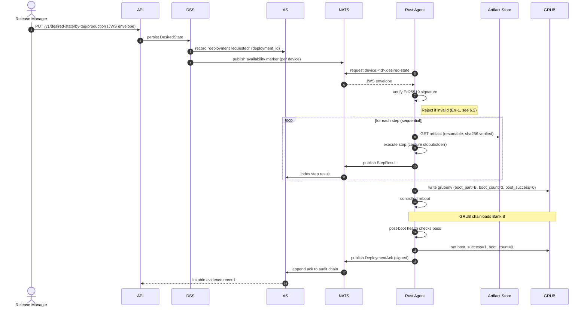
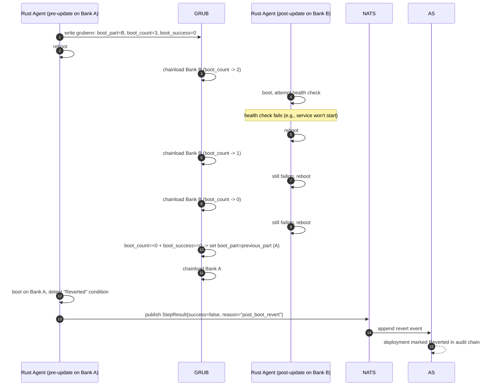
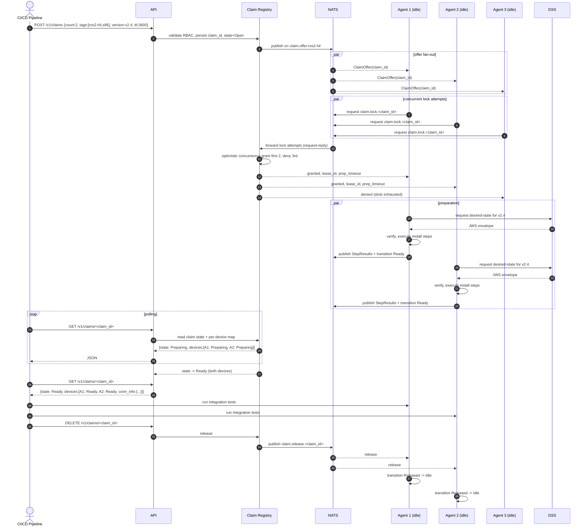
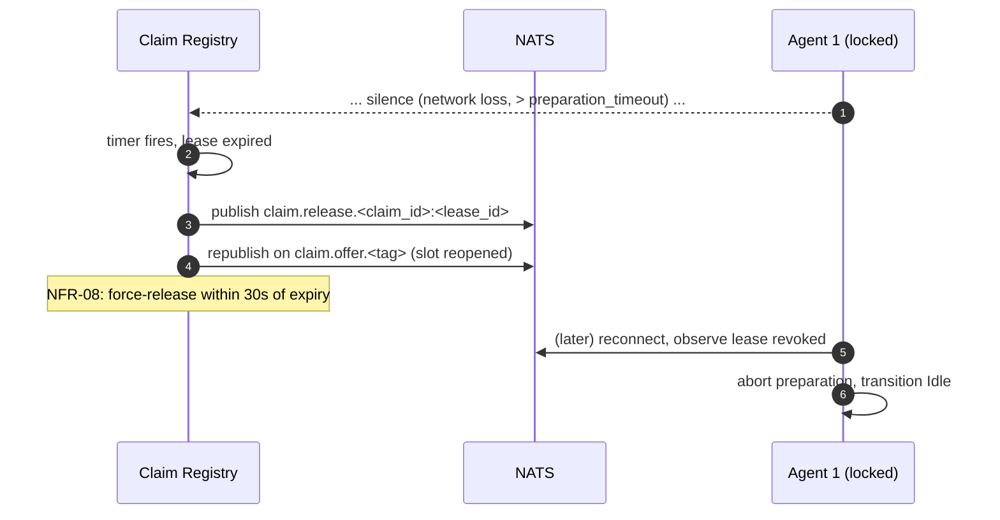
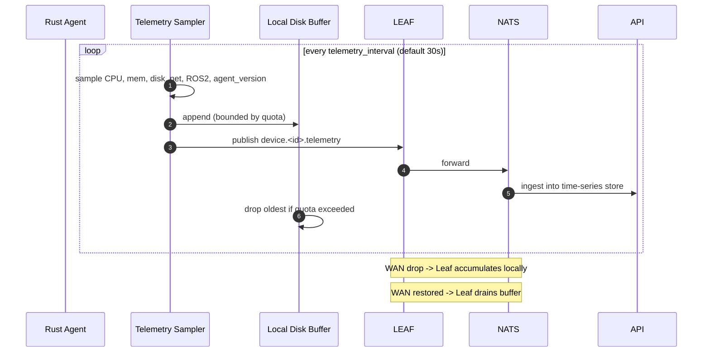

# 6. Runtime View

This section walks through the platform at runtime, one scenario per subsection. Each scenario is anchored in a use case from [`../use-cases/`](../use-cases/) and references the building blocks in [§05](05-building-block-view.md).

Participants:

- **RM** — Release Manager (human)
- **ENG** — AI / Robotics Engineer (human)
- **CI** — CI/CD Pipeline (automated client)
- **API** — Go Control Plane API
- **DSS** — Desired-State Service
- **CR** — Claim Registry
- **AS** — Audit Service
- **NATS** — NATS Hub
- **LEAF** — NATS Leaf Node (on-robot)
- **AGENT** — Rust Edge Agent
- **GRUB** — Bootloader (with boot-counter script)
- **ART** — Artifact Store

---

## 6.1 UC-01 — A/B OTA Medical Update

Anchored in [UC-01](../use-cases/UC-01-ab-ota-medical.md). Happy path including ack and audit closure.



---

## 6.2 UC-01 Err-3 — Boot-Counter Rollback

What happens when the new image boots but fails its health check.



---

## 6.3 UC-02 — ROS2 Modular Deployment

Anchored in [UC-02](../use-cases/UC-02-ros2-modular-deploy.md). Includes the Leaf Node and shows local-first behaviour.

```mermaid
sequenceDiagram
    autonumber
    actor ENG as Robotics Engineer
    participant API
    participant DSS
    participant NATS as NATS Hub
    participant LEAF as NATS Leaf (on robot)
    participant AGENT as Rust Agent (on robot)
    participant ART as Artifact Store
    participant ROS as ROS2 Stack
    participant AS

    ENG->>API: PUT /v1/desired-state/by-serial/<robot> (JWS envelope)
    API->>DSS: persist DesiredState
    DSS->>NATS: publish availability marker
    NATS->>LEAF: federated forward
    AGENT->>LEAF: request device.<id>.desired-state (low-latency local)
    LEAF-->>AGENT: JWS envelope
    AGENT->>AGENT: verify signature

    AGENT->>ROS: systemctl stop ros2-app.service (SCRIPT_EXECUTION)
    AGENT->>LEAF: publish StepResult
    AGENT->>ART: GET model_v3.bin (FILE_TRANSFER, resumable)
    Note right of AGENT: link drops; agent retries with backoff
    AGENT->>ART: GET model_v3.bin (resume from offset)
    AGENT->>LEAF: publish StepResult
    AGENT->>AGENT: atomic symlink swap (SCRIPT_EXECUTION)
    AGENT->>LEAF: publish StepResult
    AGENT->>ROS: systemctl restart ros2-app.service (SYSTEM_SERVICE)
    AGENT->>ROS: poll until active (within readiness timeout)
    AGENT->>LEAF: publish StepResult{success=true}
    AGENT->>LEAF: publish DeploymentAck (signed)

    Note over LEAF,NATS: WAN reconnects; Leaf flushes buffered messages
    LEAF->>NATS: forward queued StepResults + Ack
    NATS->>AS: append to audit chain
```

---

## 6.4 UC-03 — CI/CD HIL Device Claiming

Anchored in [UC-03](../use-cases/UC-03-cicd-hil-claiming.md). Concurrent lockers and TTL behaviour shown.



### UC-03 Alt-2 — Lock TTL Force-Release



---

## 6.5 Agent Self-Update (FR-19)

```mermaid
sequenceDiagram
    autonumber
    participant AGENT as Rust Agent v1
    participant NATS
    participant ART
    participant SYSD as systemd
    participant FS as Filesystem
    participant AGENT2 as Rust Agent v2 (post-restart)

    AGENT->>NATS: pull desired state for self
    NATS-->>AGENT: JWS envelope (manifest with FlashAgent step)
    AGENT->>AGENT: verify signature
    AGENT->>ART: GET ota-agent-v2 (sha256, resumable)
    AGENT->>FS: write to /usr/local/lib/ota-agent/agent.new
    AGENT->>AGENT: verify Ed25519 signature on the binary itself
    AGENT->>FS: rename(agent.new, agent) - atomic
    AGENT->>SYSD: systemctl restart ota-agent.service
    Note over AGENT,SYSD: process exits; systemd respawns from new binary
    AGENT2->>NATS: heartbeat with new agent_version
    AGENT2->>NATS: publish DeploymentAck (signed by device key)
```

**Failure handling.**
- If the rename succeeds but the new binary fails to start, systemd retries up to a configured limit; on persistent failure, an out-of-band watchdog (separate `ota-agent-watchdog.service`) restores `/usr/local/lib/ota-agent/agent.bak` (the prior binary preserved during stage).
- The watchdog is intentionally **not** itself self-updatable in v1 to maintain a known-good recovery path.

---

## 6.6 Telemetry Loop (FR-18)



---

## 6.7 Cross-Cutting: NATS Reconnection Behaviour (NFR-04)

All agent NATS publishes use exponential backoff with jitter (initial 1s, cap 60s). Pull requests (`device.<id>.desired-state`) are issued on a fixed cadence (`poll_interval`, default 30s) plus on heartbeat-loss-recovery. JetStream subjects (`telemetry`, `step-result`, `ack`) are durable and survive disconnects without message loss within the JetStream retention policy.
