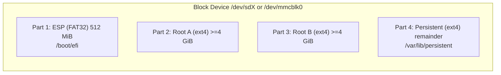

# 7. Deployment View

This section maps the building blocks from [§05](05-building-block-view.md) onto physical and virtual infrastructure. The deployment is **cloud-agnostic** ([NFR-14](../requirements/non-functional.md#nfr-14--cloud-agnostic-deployment)): everything runs on any CNCF-conformant Kubernetes plus standard storage and PKI primitives.

## 7.1 Top-Level Topology

```mermaid
flowchart TB
    subgraph cluster [Kubernetes Cluster (any cloud or on-prem)]
        subgraph ns_cp [Namespace: ota-control-plane]
            APIDep["Deployment: api-gateway (HPA, 3..N pods)"]
            DSSDep["Deployment: desired-state-svc"]
            CRDep["Deployment: claim-registry"]
            ASDep["Deployment: audit-svc"]
            JOBs["CronJobs: ttl-sweeper, audit-export"]
        end
        subgraph ns_data [Namespace: ota-data]
            PG[(StatefulSet: Postgres / patroni)]
            S3API["Deployment: object-store gateway\n(or external S3-compatible)"]
            WORM[(Bucket / DB: WORM audit store)]
        end
        subgraph ns_msg [Namespace: ota-messaging]
            NATS["StatefulSet: NATS cluster\n(3..5 pods, JetStream)"]
            CertMgr["cert-manager (mTLS PKI)"]
        end
        subgraph ns_obs [Namespace: ota-observability]
            Prom["Prometheus + AlertManager"]
            Otel["OpenTelemetry Collector"]
            Loki["Loki (logs)"]
        end
        Ingress["Ingress / LoadBalancer (mTLS)"]
    end

    Ingress --> APIDep
    APIDep --> DSSDep
    APIDep --> CRDep
    APIDep --> ASDep
    DSSDep --> PG
    CRDep --> PG
    ASDep --> WORM
    DSSDep --> NATS
    CRDep --> NATS
    ASDep --> NATS
    DSSDep --> S3API
    APIDep --> Otel
    DSSDep --> Otel
    CRDep --> Otel
    ASDep --> Otel
    Otel --> Prom
    Otel --> Loki

    subgraph site [Customer / Field Site]
        subgraph robot [Robot]
            LeafPod["NATS Leaf Node\n(systemd or k3s pod)"]
            AgentRobot["ota-agent.service (Rust)"]
            ROS["ROS2 Stack"]
        end
        subgraph dev [Medical / HIL Device]
            AgentDev["ota-agent.service (Rust)"]
            BootDev["GRUB + ext4 A/B"]
        end
    end

    Pipeline["CI/CD Runner"]
    User["Release Mgr / Engineer (Browser/CLI)"]

    User -->|"HTTPS mTLS"| Ingress
    Pipeline -->|"HTTPS mTLS"| Ingress
    LeafPod <-->|"NATS Leaf federation\n(WAN, mTLS)"| NATS
    AgentRobot <-->|"NATS local"| LeafPod
    AgentDev <-->|"NATS WAN mTLS"| NATS
    AgentRobot -->|"HTTPS GET"| S3API
    AgentDev -->|"HTTPS GET"| S3API
```

## 7.2 Control-Plane Deployment Detail

| Workload | Kind | Replicas | Notes |
|----------|------|----------|-------|
| `api-gateway` | Deployment | ≥ 3, HPA on RPS | Stateless; terminates mTLS, mounts trust store. |
| `desired-state-svc` | Deployment | ≥ 2 | Stateless; reads/writes Postgres. |
| `claim-registry` | Deployment | ≥ 2 | Uses Postgres advisory locks for optimistic concurrency. Leader election via lease for the TTL sweeper. |
| `audit-svc` | Deployment | ≥ 2 | Writes to WORM store; exposes export. |
| `ttl-sweeper` | CronJob (every 10 s) | 1 | Force-releases expired claims/locks (NFR-08). May also run inside `claim-registry` as a leader-elected loop. |
| `audit-export` | CronJob (nightly) | 1 | Generates daily evidence bundles for regulators. |
| `postgres` | StatefulSet (e.g. CNPG / Patroni) | 3 | HA Postgres; PITR snapshots. |
| `nats` | StatefulSet | 3..5 | JetStream enabled; persistent volumes per pod. |
| `cert-manager` | Deployment | 1 | Issues mTLS certs to control-plane pods and (via separate flow) to devices at registration. |

### Helm Chart Layout (planned)

```text
charts/
  ota-control-plane/
    Chart.yaml
    values.yaml          # all knobs (image tags, replicas, TLS issuer, storage class)
    templates/
      api-gateway.yaml
      desired-state.yaml
      claim-registry.yaml
      audit-svc.yaml
      cronjobs.yaml
      networkpolicies.yaml
      poddisruptionbudgets.yaml
  ota-nats/
    Chart.yaml           # thin wrapper over upstream nats-server chart with mTLS preset
  ota-postgres/
    Chart.yaml           # opinionated CNPG values
```

## 7.3 NATS Topology

```mermaid
flowchart LR
    subgraph hub [NATS Cluster (cloud)]
        n1["nats-0"]
        n2["nats-1"]
        n3["nats-2"]
        n1 <--> n2
        n2 <--> n3
        n1 <--> n3
    end

    subgraph robotA [Robot A]
        leafA["Leaf Node A"]
        agentA["Agent A"]
    end

    subgraph robotB [Robot B]
        leafB["Leaf Node B"]
        agentB["Agent B"]
    end

    devC["Medical Device C\n(direct connect)"]
    devD["HIL Rig D\n(direct connect)"]

    leafA -->|"leaf TLS, outbound only"| n1
    leafB -->|"leaf TLS, outbound only"| n2
    agentA <-->|"local NATS"| leafA
    agentB <-->|"local NATS"| leafB
    devC <-->|"WAN mTLS"| n2
    devD <-->|"WAN mTLS"| n3
```

**Key properties:**

- Leaf Nodes connect **outbound only** to the hub; no inbound connectivity required at the site (TC-02).
- Subjects are scoped per device by ACL; cross-tenancy isolation is enforced at the NATS auth layer.
- JetStream provides durable streams for `device.*.telemetry`, `device.*.step-result`, `device.*.ack`, and `audit.deployment.*`. Retention is policy-driven (size + age).
- Leaf Nodes buffer outbound publishes during WAN outages; replay is automatic on reconnection.

## 7.4 Device Disk Layout (ext4 A/B variant)



**Mount strategy at runtime:**

- Active root (whichever bank GRUB chainloaded) mounted as `/`, read-write or read-only per profile.
- Inactive root **never** mounted at `/`; agent mounts it transiently to verify integrity post-flash.
- `/var/lib/persistent` always mounted; holds telemetry buffer, model cache, agent trust store, audit-relevant state that must survive both banks.
- `/boot/efi` mounted read-write only when agent is updating `grubenv`; otherwise read-only.

### Btrfs Snapshot Variant (FR-20)

Single root partition; subvolumes for `@`, `@home`, `@var`. Update flow takes a snapshot of `@`, replaces or mutates the candidate, swaps default subvol via `btrfs subvolume set-default`, reboots. Rollback restores the prior default subvol.

## 7.5 Edge Agent Filesystem Layout

| Path | Owner | Purpose |
|------|-------|---------|
| `/usr/local/bin/ota-agent` | `root:root` 0755 | Active agent binary (symlink to versioned location). |
| `/usr/local/lib/ota-agent/agent` | `root:root` 0755 | The actual binary; target of atomic rename during self-update. |
| `/usr/local/lib/ota-agent/agent.bak` | `root:root` 0755 | Previous binary, preserved for watchdog rescue. |
| `/etc/ota-agent/config.toml` | `root:ota-agent` 0640 | Static config (NATS URL, poll intervals, log level). |
| `/etc/ota-agent/trust-store/` | `root:ota-agent` 0750 | Public keys (PEM) keyed by `kid`. |
| `/etc/systemd/system/ota-agent.service` | `root:root` 0644 | Unit file (Restart=always, hardened). |
| `/var/lib/ota-agent/state.db` | `ota-agent:ota-agent` 0660 | Local state (current deployment, last poll, agent state machine snapshot). |
| `/var/lib/ota-agent/telemetry-buffer/` | `ota-agent:ota-agent` 0700 | Disk buffer for telemetry (NFR-06). Quota enforced. |
| `/var/lib/ota-agent/staging/` | `ota-agent:ota-agent` 0700 | Working dir for downloads & step execution. |
| `/var/log/ota-agent/` | `ota-agent:ota-agent` 0750 | Local logs (also shipped via telemetry where configured). |

## 7.6 Cross-Compilation Matrix

| Target Triple | libc | Use |
|---------------|------|-----|
| `x86_64-unknown-linux-musl` | musl | Server-class HIL rigs, x86 medical devices. |
| `aarch64-unknown-linux-musl` | musl | ARM robots (Jetson-class), ARM medical devices. |
| `armv7-unknown-linux-musleabihf` | musl | (Optional, NFR-04 derived) — older ARMv7 devices; deferred to v1.1. |

CI builds release binaries per target; size budget per [NFR-10](../requirements/non-functional.md#nfr-10--agent-binary-size-budget-from-nfr-03).

## 7.7 Identity & PKI

- **Control-plane internal**: cert-manager issues short-lived certs to pods.
- **Device identity**: each device's serial maps to a long-lived Ed25519 keypair; the public key is registered with the control plane at provisioning. The device's mTLS client cert is short-lived and rotated by an on-device renewal protocol bootstrapped from the serial-bound identity.
- **Manifest signing keys**: separate from device keys; held by Release Manager / pipelines. v1: filesystem with strict ACLs + audit. v2 (out of scope): HSM.
