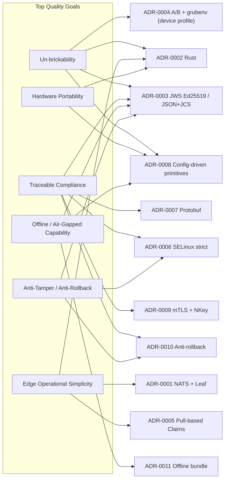

# 9. Architectural Decisions

This section indexes the Architectural Decision Records (ADRs) that shape the platform. Full ADR text lives in [`../adr/`](../adr/).

## 9.1 Status Legend

- **Proposed** — drafted, awaiting decision-maker approval.
- **Accepted** — approved; implementation may proceed.
- **Deprecated** — no longer in force, kept for historical context.
- **Superseded by ADR-XXXX** — replaced by another ADR.

## 9.2 Index

| ID | Title | Status | Drives |
|----|-------|--------|--------|
| [ADR-0001](../adr/ADR-0001-nats-over-http-rest.md) | NATS (with Leaf Nodes) for device traffic | Proposed | FR-08, NFR-04, NFR-06, NFR-11 |
| [ADR-0002](../adr/ADR-0002-rust-for-edge-agent.md) | Rust for the edge agent (single static musl binary) | Proposed | NFR-02, NFR-03, NFR-10 |
| [ADR-0003](../adr/ADR-0003-jws-ed25519-manifests.md) | JWS Compact + Ed25519 (EdDSA) over JCS JSON for manifest signing | Proposed | FR-10, FR-11, NFR-01 |
| [ADR-0004](../adr/ADR-0004-ab-partitioning-grubenv.md) | ext4 A/B + GRUB `grubenv` reference device profile (Btrfs snapshot variant) | Proposed | FR-03..FR-06, FR-20 |
| [ADR-0005](../adr/ADR-0005-pull-based-claim-model.md) | Pull-based asynchronous Claim Registry | Proposed | FR-07..FR-09, FR-15..FR-17, NFR-08, NFR-09 |
| [ADR-0006](../adr/ADR-0006-selinux-strict-policy.md) | SELinux strict TE with `type_transition` and no `execmem` / dynamic transitions | Proposed | NFR-12 |
| [ADR-0007](../adr/ADR-0007-protobuf-contracts.md) | Protobuf as the canonical wire contract language for machine messages | Proposed | FR-11, FR-18 (and machine-level FRs) |
| [ADR-0008](../adr/ADR-0008-config-driven-primitive-engine.md) | Config-driven primitive execution engine ("dumb agent" principle) | Proposed | FR-01, FR-23, FR-24, NFR-02, NFR-15 |
| [ADR-0009](../adr/ADR-0009-nats-nkey-authentication.md) | Two-factor NATS authentication: mTLS + NATS NKey | Proposed | NFR-11, FR-08 |
| [ADR-0010](../adr/ADR-0010-anti-rollback-enforcement.md) | Anti-rollback enforcement (`lower_limit` + monotonic version counter) | Proposed | FR-25, FR-26, NFR-16 |
| [ADR-0011](../adr/ADR-0011-offline-bundle-format.md) | Offline / air-gapped bundle format (`bundle://` transport) | Proposed | FR-27, FR-29, NFR-06, NFR-14 |

## 9.3 Decision Map

## 9.4 Decision Lifecycle

- New decisions: open a new ADR with the next sequential ID, status `Proposed`.
- Approved: status moves to `Accepted` after sign-off by Architecture Working Group + Security Officer.
- Replaced: never modify; write a new ADR that **supersedes** the old one and update the old one's status to `Superseded by ADR-XXXX`.
- Deprecated without replacement: rare; mark `Deprecated` and explain in a final paragraph.
