# 10. Quality Requirements

This section formalizes the non-functional requirements as **measurable quality scenarios**, following the SEI Quality-Attribute-Scenario template (Source / Stimulus / Environment / Response / Response Measure). Each scenario back-references the [NFR](../requirements/non-functional.md) it instantiates.

## 10.1 Quality Tree

```mermaid
flowchart TB
    Root["Platform Quality"]
    Root --> Safety
    Root --> Compliance
    Root --> Security
    Root --> Resilience
    Root --> Portability
    Root --> Performance

    Safety --> QS01["QS-05 Health-check window\n(NFR-05)"]
    Safety --> QS02["QS-02 Memory safety\n(NFR-02)"]
    Compliance --> QS03["QS-01 End-to-end traceability\n(NFR-01, NFR-13)"]
    Security --> QS04["QS-11 Authenticated transport\n(NFR-11)"]
    Security --> QS05["QS-12 SELinux confinement\n(NFR-12)"]
    Resilience --> QS06["QS-04 Network partition recovery\n(NFR-04)"]
    Resilience --> QS07["QS-06 Robot autonomy 24h\n(NFR-06)"]
    Resilience --> QS08["QS-08 Bounded force-release\n(NFR-08)"]
    Resilience --> QS09["QS-09 Linearizable claim locks\n(NFR-09)"]
    Portability --> QS10["QS-03 Cross-compilation\n(NFR-03)"]
    Portability --> QS11["QS-14 Cloud-agnostic deploy\n(NFR-14)"]
    Performance --> QS12["QS-07 Resumable downloads\n(NFR-07)"]
    Performance --> QS13["QS-10 Agent binary size budget\n(NFR-10)"]
```

## 10.2 Quality Scenarios

### QS-01 Traceability End-to-End
- **Realizes:** [NFR-01](../requirements/non-functional.md#nfr-01--traceability-for-medical-compliance), [NFR-13](../requirements/non-functional.md#nfr-13--append-only-audit-immutability-reinforces-fr-12).
- **Source:** Auditor.
- **Stimulus:** Requests evidence for `deployment_id=D` against device `serial=S`.
- **Environment:** Production; deployment occurred ≥ 1 day ago.
- **Response:** System produces a signed evidence bundle containing the original signed `DesiredState`, all `StepResult`s, the device's `DeploymentAck` (verifiable Ed25519 signature), and a hash-chain anchor.
- **Response Measure:** Bundle generated within ≤ 60 s; bundle signature verifies against published key; hash chain integrity verified on the auditor's machine without contacting the platform.

### QS-02 Memory Safety Enforcement
- **Realizes:** [NFR-02](../requirements/non-functional.md#nfr-02--rust-for-memory-safety).
- **Source:** Developer.
- **Stimulus:** Pull request introduces `unsafe` Rust outside the FFI allowlist.
- **Environment:** CI.
- **Response:** Build fails with explicit lint message; PR cannot merge.
- **Response Measure:** 0 % of merged PRs contain non-allowlisted `unsafe`. Allowlist changes require Security Officer review.

### QS-03 Cross-Compilation and Static Linkage
- **Realizes:** [NFR-03](../requirements/non-functional.md#nfr-03--single-statically-linked-binary-arm--x86).
- **Source:** Release engineer.
- **Stimulus:** Triggers a release build.
- **Environment:** CI matrix.
- **Response:** Release artifacts produced for `x86_64-unknown-linux-musl` and `aarch64-unknown-linux-musl`; each binary is statically linked (`ldd` reports "not a dynamic executable").
- **Response Measure:** Build succeeds for both targets in ≤ 15 min wall clock; static-linkage assertion passes.

### QS-04 Network Partition Recovery
- **Realizes:** [NFR-04](../requirements/non-functional.md#nfr-04--polling-resilience-over-nats).
- **Source:** Chaos test.
- **Stimulus:** Sever NATS connectivity for a device for 24 hours.
- **Environment:** Test fleet.
- **Response:** Upon reconnection, the device reconciles state, resumes any in-flight deployment from the last persisted step, and replays buffered telemetry.
- **Response Measure:** Reconciliation observable within ≤ 60 s of restored connectivity; zero lost JetStream-backed messages within retention window.

### QS-05 Health-Check Window
- **Realizes:** [NFR-05](../requirements/non-functional.md#nfr-05--health-check-confirmation-window-from-uc-01).
- **Source:** Updated device.
- **Stimulus:** First successful boot of the new bank.
- **Environment:** Production device.
- **Response:** Agent runs configured health checks and sets `boot_success=1`.
- **Response Measure:** Time from `systemd` "boot complete" to `boot_success=1` ≤ 120 s by default; configurable per profile.

### QS-06 Robot Autonomy During Cloud Outage
- **Realizes:** [NFR-06](../requirements/non-functional.md#nfr-06--robot-autonomy-during-cloud-outage-from-uc-02).
- **Source:** Field robot.
- **Stimulus:** Cellular/Wi-Fi link drops for 24 hours.
- **Environment:** Production.
- **Response:** Local ROS2 traffic continues without disruption; outbound telemetry buffers up to configured quota; on reconnect, telemetry replays in order.
- **Response Measure:** No local-loop interruption observable; telemetry loss only if quota exceeded; reconnect drain rate ≥ accumulation rate.

### QS-07 Resumable Artifact Download
- **Realizes:** [NFR-07](../requirements/non-functional.md#nfr-07--resumable-artifact-downloads-from-uc-02).
- **Source:** Agent's HTTP fetcher.
- **Stimulus:** Network drops at 80 % of a 2 GiB artifact download.
- **Environment:** Cellular link, restored 30 s later.
- **Response:** Fetcher resumes from the last received byte using HTTP `Range`.
- **Response Measure:** Total bytes transferred over the wire ≤ 1.05 × artifact size; no full restart.

### QS-08 Bounded Force-Release Latency
- **Realizes:** [NFR-08](../requirements/non-functional.md#nfr-08--bounded-force-release-latency-from-uc-03).
- **Source:** Claim Registry sweeper.
- **Stimulus:** A locked claim's preparation timeout expires.
- **Environment:** Production.
- **Response:** Slot is force-released and re-offered to the pool.
- **Response Measure:** ≤ 30 s from expiry to slot becoming `Open`.

### QS-09 Linearizable Claim Locks
- **Realizes:** [NFR-09](../requirements/non-functional.md#nfr-09--linearizable-claim-locks-from-uc-03).
- **Source:** Concurrent agents.
- **Stimulus:** N=100 agents race for `count=10` slots.
- **Environment:** Load test.
- **Response:** Exactly 10 agents observe `granted=true`; 90 observe `granted=false`.
- **Response Measure:** 100 % correctness across ≥ 1 000 trials.

### QS-10 Agent Binary Size Budget
- **Realizes:** [NFR-10](../requirements/non-functional.md#nfr-10--agent-binary-size-budget-from-nfr-03).
- **Source:** CI size check.
- **Stimulus:** Release build for `aarch64-unknown-linux-musl`.
- **Environment:** CI.
- **Response:** Size measured.
- **Response Measure:** ≤ 20 MiB uncompressed; build fails otherwise.

### QS-11 Authenticated Transport
- **Realizes:** [NFR-11](../requirements/non-functional.md#nfr-11--all-transport-authenticated-from-fr-08-fr-10).
- **Source:** Penetration test.
- **Stimulus:** Attempt to connect to NATS or REST without a valid client cert.
- **Environment:** Any environment (incl. dev).
- **Response:** Connection refused at TLS layer.
- **Response Measure:** 100 % of connections without valid cert refused; auditable in NATS/Ingress logs.

### QS-12 SELinux Confinement
- **Realizes:** [NFR-12](../requirements/non-functional.md#nfr-12--selinux-strict-confinement-from-brief-deliverable-51).
- **Source:** Adversarial test.
- **Stimulus:** A signed manifest contains a script that attempts (a) raw block-device write, (b) kernel module load, (c) `grubenv` write.
- **Environment:** Production-equivalent device.
- **Response:** All three operations denied by SELinux policy; `auditd` records AVC denials.
- **Response Measure:** All three denials present; agent does not crash; manifest reported as failed step.

### QS-13 Memory & Footprint at Idle
- **Realizes:** Agent operational quality (NFR-02 + NFR-03 ancillary).
- **Source:** Production telemetry.
- **Stimulus:** Agent in `Idle` state, telemetry every 30 s.
- **Environment:** Production device.
- **Response:** Resident set size remains bounded.
- **Response Measure:** Steady-state RSS ≤ 50 MiB; CPU ≤ 1 % on a 1 GHz Cortex-A.

### QS-14 Cloud-Agnostic Deployment
- **Realizes:** [NFR-14](../requirements/non-functional.md#nfr-14--cloud-agnostic-deployment).
- **Source:** Deployment engineer.
- **Stimulus:** Install platform on a fresh CNCF-conformant Kubernetes cluster (e.g., k3s on bare metal; managed K8s on cloud X).
- **Environment:** Two distinct K8s providers in CI.
- **Response:** Helm chart installs and passes the smoke-test pipeline on both.
- **Response Measure:** No cloud-vendor-specific resource (`apiVersion` outside the standard set) appears in any rendered template.
