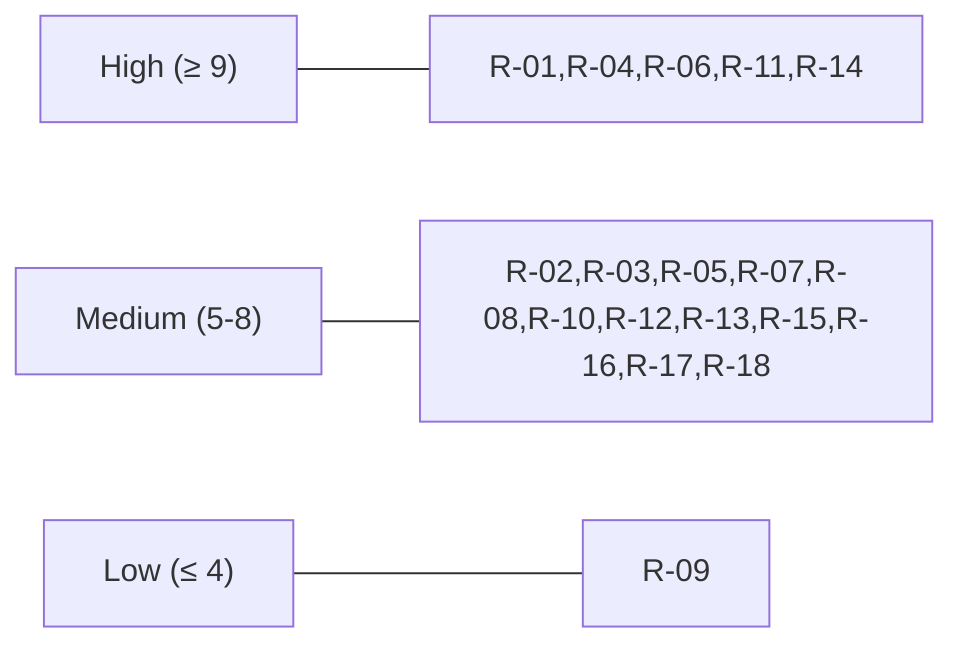

# 11. Risks and Technical Debt

This section enumerates the known risks and the deliberate technical debt accepted to ship v1. Each item is rated for **Likelihood** and **Impact** on a 1–5 scale; the **Risk Score** is `L × I`.

## 11.1 Top Risks

| ID | Risk | Likelihood | Impact | Score | Mitigation | Owner |
|----|------|:----------:|:------:|:-----:|------------|-------|
| R-01 | **Brick risk via `grubenv` corruption** mid-write (sudden power loss) | 2 | 5 | 10 | Atomic write + read-back verification in GRUB Manager; boot-counter guarantees second-attempt fallback; field tests with random power-cuts. | Embedded Eng |
| R-02 | **Manifest signing key compromise** | 1 | 5 | 5 | Filesystem ACL + audit on key access in v1; HSM in v2; per-device ack signatures localize blast radius; documented key-rotation procedure. | Security Officer |
| R-03 | **NATS split-brain or JetStream data loss** | 2 | 4 | 8 | 3..5 node cluster with persistent volumes; JetStream replicas ≥ 3 for durable streams; runbook for split-brain recovery. | SRE |
| R-04 | **SELinux policy gaps** (denials block legitimate operations) | 3 | 3 | 9 | Permissive-mode CI gate; `audit2allow` triage process; staged rollout per device profile. | Security Officer + SRE |
| R-05 | **Claim starvation** under heavy contention from a single pipeline | 2 | 3 | 6 | Per-principal claim quota (RBAC); FIFO offer order; explicit priority classes deferred to v1.1. | Platform Eng |
| R-06 | **Boot-counter window mistuned** (too small → false reverts; too large → slow rollback) | 3 | 3 | 9 | Per-profile defaults documented; field telemetry on boot times informs revisions. | Embedded Eng |
| R-07 | **Self-update bricks the agent** (binary verifies but fails to run) | 2 | 4 | 8 | Atomic rename + `agent.bak` + watchdog rescue service; staged rollout with canary devices. | Platform Eng |
| R-08 | **Cellular link with high packet loss starves NATS** keepalives | 3 | 2 | 6 | Tuned keepalive intervals; Leaf Node buffering; jittered backoff. | SRE |
| R-09 | **Audit hash chain inconsistency** across audit-svc replicas | 1 | 4 | 4 | Single-writer at the chain head (leader-elected); cross-replica reconciliation on startup. | Platform Eng |
| R-10 | **Postgres advisory locks contended** at very large fleet sizes | 2 | 3 | 6 | Indexed claim lookups; sharding by tag if measured; load tests inform threshold. | Platform Eng |
| R-11 | **Trust store tampering** by a local root attacker on device | 2 | 5 | 10 | SELinux confinement of trust-store path; immutability flag where supported; future TPM-bound storage in v2. | Security Officer |
| R-12 | **Btrfs metadata corruption** on rollback of variant deployments | 2 | 4 | 8 | Btrfs checks during health verification; fall back to ext4 A/B variant if Btrfs proves unstable on a given device class. | Embedded Eng |
| R-13 | **REST API breaking changes leak through `/v1`** | 2 | 3 | 6 | `buf breaking` checks for Protobuf; OpenAPI diff in CI for REST; URL versioning policy enforced. | Platform Eng |
| R-14 | **Operator misconfigures `boot_count` or readiness timeout** in profile | 3 | 4 | 12 | Validated config schema; sane defaults; CI for profile bundles; warn on deviations. | SRE |
| R-15 | **Rollback state tampering on devices without TPM** — the `max_seen_version` journal could be rewound by a root-level attacker on non-TPM devices, defeating anti-rollback. | 2 | 4 | 8 | NFR-16 mandates TPM 2.0 NV index for medical-device class (UC-01); SELinux `ota_rollback_t` confinement + hash-chained journal for fallback; divergence-alert between TPM and journal where both exist. v2: expand secure-element fallback coverage. | Security Officer |
| R-16 | **Offline bundle introduced by insider or stolen operator credentials** — physical-access path can present a correctly-signed (not-expired) bundle that predates a security fix. | 2 | 4 | 8 | Anti-rollback (ADR-0010) catches version regression; CLI apply requires per-site operator key challenge; optional factory-signed co-signature for class-A bundles (v1.1). Audit records every offline apply with bundle SHA-256. | Security Officer |
| R-17 | **`artifacts[]` / step-hash drift at publish time** — pipeline bug updates step hashes without updating the top-level pin index, or vice versa, producing a manifest that fails on every device. | 3 | 2 | 6 | CI gate: manifest linter walks every step, collects referenced artifacts, asserts exact superset match with `artifacts[]`; hard-fail on drift. Agent rejects inconsistencies fail-closed at verify time. | Platform Eng |
| R-18 | **`applies_if` predicate grammar creep** — requests to add richer expressions (string regex, arithmetic) could turn the gate into a parser-surface attack vector. | 2 | 3 | 6 | Predicate grammar is deliberately closed in [§5.4.1](05-building-block-view.md#541-manifest--json-schema-sketch-jws-payload); extensions require an ADR; unknown predicate kinds fail-closed. | Architecture Working Group |

## 11.2 Accepted Technical Debt (v1)

| ID | Debt | Why accepted in v1 | Resolution Plan |
|----|------|--------------------|-----------------|
| TD-01 | **No HSM** for manifest signing keys | HSM integration adds 6+ weeks; filesystem + ACL + audit is acceptable for v1 risk profile. | v2: integrate HSM (PKCS#11) for the signing service. |
| TD-02 | **No automated trust-store rotation** | Adding `UpdateTrustStore` step type was deferred to keep v1 surface small. | v1.1: add signed `UpdateTrustStore` step type. |
| TD-03 | **No measured boot / TPM attestation** | Out of regulatory scope for v1; can be added without breaking the manifest model. | v2/v3: optional remote attestation. |
| TD-04 | **Single-region active/standby control plane** | Multi-region active-active is YAGNI for v1 fleet size. | v2: evaluate based on real fleet geography. |
| TD-05 | **Pipeline polling (no long-poll/push)** | Polling is simpler and good enough at the rates anticipated. | v1.1 if measured pipeline pain justifies it. |
| TD-06 | **Watchdog service is not itself self-updating** | Required to keep a known-good rescue path. | v2: dual-watchdog scheme allowing leapfrog upgrades. |
| TD-07 | **`armv7` cross target deferred** | Limited to a small share of expected fleet. | v1.1 once a customer requests it. |
| TD-08 | **English-only documentation and UI strings** | Localization adds noise pre-product-market-fit. | v2 if commercial expansion warrants. |
| TD-09 | **No FIPS-validated crypto module** | Not on the regulator's v1 critical path. | v2 if required by a procurement target. |
| TD-10 | **No fine-grained pipeline priority classes** | FIFO is fair enough for early adopters. | v1.1 priority-class extension on `ClaimRequest`. |
| TD-11 | **No AEAD-at-rest for bundle artifacts** — offline bundle artifacts are signed-but-plaintext; confidentiality relies on bundle-level transport (e.g., encrypted USB). | Matches our current NATS-over-TLS posture; device already trusts plaintext post-decryption; significant v1 effort to design a per-device key-wrap scheme. | v2: AES-GCM per-artifact with AAD bound to `artifacts[]` entry; per-device key-wrap (AES-KW) for confidential release classes. |
| TD-12 | **No dual-signature ("factory co-sign") on class-A offline bundles** — a single signing-key compromise enables a malicious bundle to be applied via the USB path (still gated by anti-rollback). | Adding a second-signer workflow now would complicate v1 release plumbing. | v1.1: optional `co_sig` JOSE extension requiring a second `kid` with a distinct role (e.g., `factory`); agent trust-store flags per-device-class. |
| TD-13 | **Quality scenarios QS-15 (NFR-15) and QS-16 (NFR-16) not yet authored in §10** | Verification prose deferred to the next §10 refresh. | Add alongside the next §10 pass. |

## 11.3 Risk Heatmap

## 11.4 Review Cadence

- All risks and debt items reviewed quarterly by the Architecture Working Group.
- Any risk that materializes triggers an incident review with a doc update within one sprint.
- Promotion of debt items to scheduled work requires sign-off from the affected owners.
